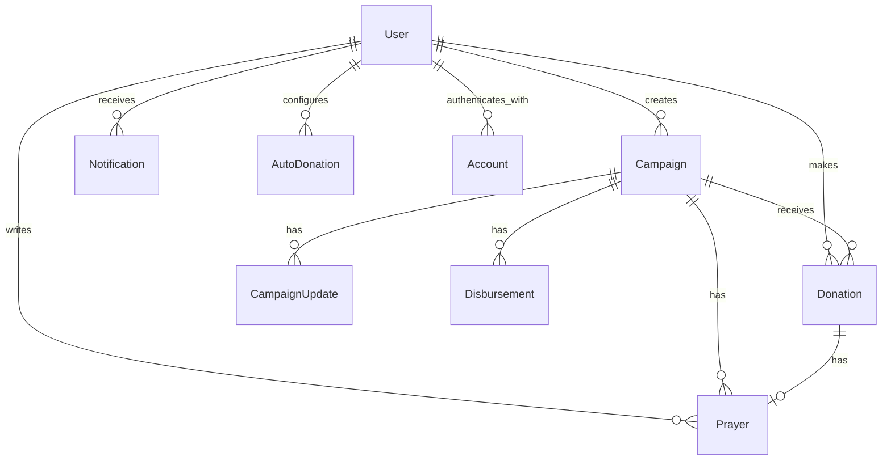

# Design Document

## Overview

This document describes the technical implementation design for the Kitabisa.com clone — a full-featured Indonesian crowdfunding/donation platform. The application will be built as a modern web application using Next.js with a mobile-first responsive design approach, matching the original platform's visual fidelity and functionality.

The clone replicates kitabisa.com's core user experience including campaign discovery, campaign details, donation flow, user authentication, zakat calculator, automatic donations, prayer wall, and responsive design — with pixel-perfect fidelity to the original platform's visual language.

## Architecture

### Technology Stack

- **Frontend Framework**: Next.js 14 (App Router) with React 18
- **Language**: TypeScript
- **Styling**: Tailwind CSS with custom design tokens matching kitabisa.com's color scheme
- **State Management**: React Context + Zustand for global state (auth, cart, notifications)
- **Data Fetching**: SWR (stale-while-revalidate) for client-side caching + ISR for campaign pages
- **Database**: PostgreSQL with Prisma ORM
- **Authentication**: NextAuth.js (email/password + Google OAuth)
- **File Storage**: Local filesystem with upload API (production: S3-compatible)
- **Payment Integration**: Mock payment gateway (simulated bank transfer, e-wallet)
- **API Layer**: Next.js API Routes (REST)
- **Image Handling**: Next.js Image component with blur placeholder + lazy loading
- **Real-time**: Server-Sent Events (SSE) for prayer wall live feed
- **Animations**: Framer Motion for page transitions and micro-interactions

### Project Structure

```
src/
├── app/
│   ├── (auth)/
│   │   ├── login/
│   │   └── register/
│   ├── (main)/
│   │   ├── page.tsx                    # Homepage
│   │   ├── explore/
│   │   │   ├── [category]/
│   │   │   └── all/
│   │   ├── campaign/
│   │   │   ├── [slug]/
│   │   │   │   ├── page.tsx            # Campaign detail
│   │   │   │   └── donation-amount/
│   │   │   └── create/
│   │   ├── search/
│   │   ├── zakat/
│   │   ├── donasi-otomatis/
│   │   ├── donasi-saya/
│   │   ├── inbox/
│   │   └── akun/
│   ├── api/
│   │   ├── auth/
│   │   ├── campaigns/
│   │   ├── donations/
│   │   ├── prayers/
│   │   │   └── stream/                 # SSE endpoint for prayer wall
│   │   ├── notifications/
│   │   ├── upload/
│   │   └── zakat/
│   └── layout.tsx
├── components/
│   ├── ui/                             # Base UI components
│   │   ├── Button.tsx
│   │   ├── ProgressBar.tsx
│   │   ├── Badge.tsx
│   │   ├── Modal.tsx
│   │   ├── Input.tsx
│   │   ├── Card.tsx
│   │   ├── Skeleton.tsx                # Skeleton loading states
│   │   └── LazyImage.tsx               # Image with blur + skeleton
│   ├── campaign/
│   │   ├── CampaignCard.tsx
│   │   ├── CampaignCardSkeleton.tsx
│   │   ├── CampaignDetail.tsx
│   │   ├── CampaignStory.tsx
│   │   ├── CampaignUpdates.tsx
│   │   └── CampaignGrid.tsx
│   ├── donation/
│   │   ├── DonationAmountSelector.tsx
│   │   ├── PaymentMethodSelector.tsx
│   │   └── DonationConfirmation.tsx
│   ├── home/
│   │   ├── HeroBanner.tsx
│   │   ├── QuickActionTiles.tsx
│   │   ├── UrgentCampaigns.tsx
│   │   ├── CategorySection.tsx
│   │   └── PrayerWall.tsx
│   ├── layout/
│   │   ├── BottomNavBar.tsx
│   │   ├── DesktopHeader.tsx
│   │   ├── Footer.tsx
│   │   └── PageTransition.tsx          # Framer Motion page wrapper
│   └── shared/
│       ├── ShareModal.tsx
│       ├── SearchBar.tsx
│       ├── VerificationBadge.tsx
│       └── SEOHead.tsx                 # Dynamic OG tags
├── lib/
│   ├── prisma.ts
│   ├── auth.ts
│   ├── utils/
│   │   ├── currency.ts                 # Rupiah formatting
│   │   ├── date.ts                     # Indonesian date formatting
│   │   ├── validation.ts
│   │   └── zakat.ts                    # Zakat calculation
│   └── hooks/
│       ├── useCampaigns.ts             # SWR-based campaign fetching
│       ├── useDonation.ts
│       ├── useNotifications.ts
│       └── usePrayerStream.ts          # SSE hook for prayer wall
├── store/
│   ├── authStore.ts
│   └── notificationStore.ts
├── types/
│   ├── campaign.ts
│   ├── donation.ts
│   ├── user.ts
│   └── notification.ts
└── styles/
    └── globals.css                     # Tailwind base + custom tokens
```

### Caching Strategy

- **Client-side (SWR)**: All campaign lists, prayer wall, and notification data use SWR with `revalidateOnFocus: true` and stale time of 30 seconds. Optimistic updates for amiin count and donation submission.
- **ISR (Incremental Static Regeneration)**: Campaign detail pages use ISR with `revalidate: 60` (1 minute). Homepage uses ISR with `revalidate: 300` (5 minutes).
- **Static Generation**: Category pages, Zakat info pages generated at build time.
- **API Response Cache**: `Cache-Control: public, s-maxage=60, stale-while-revalidate=300` for campaign list endpoints.

### SEO and Meta Tags Strategy

- **Dynamic OG tags**: Each campaign detail page generates `og:title`, `og:description`, `og:image` from campaign data via `generateMetadata()` in Next.js App Router.
- **Structured Data**: Campaign pages include JSON-LD schema (`DonateAction`, `Organization`, `Event`) for rich search results.
- **Sitemap**: Auto-generated sitemap.xml listing all active campaigns with `lastmod` based on `updatedAt`.
- **Canonical URLs**: All pages include `<link rel="canonical">` to prevent duplicate content.
- **Twitter Cards**: `twitter:card=summary_large_image` for campaign shares.

### Real-time Updates (Prayer Wall)

Instead of polling, the prayer wall uses Server-Sent Events (SSE):
- **Endpoint**: `GET /api/prayers/stream` — keeps connection open, pushes new prayers as they arrive.
- **Client hook**: `usePrayerStream()` — connects to SSE, buffers incoming prayers, merges with initial SWR data.
- **Fallback**: If SSE connection drops, falls back to SWR polling every 30 seconds with automatic reconnect.
- **Backpressure**: Server batches prayers if more than 5 arrive within 2 seconds, sends as a batch.

### Animation and Transitions

- **Page transitions**: Framer Motion `AnimatePresence` wrapping route changes with fade + slide-up (200ms ease-out).
- **Micro-interactions**: Button press scale (0.97), card hover lift (translateY -2px + shadow), amiin button pulse animation.
- **Loading animations**: Skeleton shimmer (CSS keyframe), progress bar fill animation (600ms ease-in-out on mount).
- **Scroll animations**: Campaign cards in grid use `IntersectionObserver` for staggered fade-in on scroll.
- **Bottom nav**: Active tab indicator slides with spring animation matching kitabisa.com behavior.

## Components and Interfaces

### UI Base Components

#### `Button`
```typescript
interface ButtonProps {
  variant: 'primary' | 'secondary' | 'ghost' | 'danger';
  size: 'sm' | 'md' | 'lg' | 'full';
  isLoading?: boolean;
  disabled?: boolean;
  leftIcon?: React.ReactNode;
  rightIcon?: React.ReactNode;
  onClick?: () => void;
  children: React.ReactNode;
}
```

#### `ProgressBar`
```typescript
interface ProgressBarProps {
  current: number;          // collected amount
  target: number;           // target amount
  showLabel?: boolean;      // show percentage text
  size?: 'sm' | 'md';      // height variant
  animated?: boolean;       // animate fill on mount
}
// Calculates percentage internally: Math.min((current / target) * 100, 100)
// Uses kitabisa gradient: orange-to-red fill on gray background
```

#### `Skeleton`
```typescript
interface SkeletonProps {
  variant: 'text' | 'circular' | 'rectangular' | 'card';
  width?: string | number;
  height?: string | number;
  lines?: number;           // for text variant
  animated?: boolean;       // shimmer animation (default: true)
}
// Matches kitabisa.com's loading skeleton UX with shimmer effect
```

#### `LazyImage`
```typescript
interface LazyImageProps {
  src: string;
  alt: string;
  width: number;
  height: number;
  blurDataURL?: string;     // base64 blur placeholder
  className?: string;
  priority?: boolean;       // skip lazy loading for above-fold
  onLoad?: () => void;
  fallback?: React.ReactNode; // custom fallback while loading
}
// Wraps Next.js Image with skeleton placeholder until loaded
```

#### `Modal`
```typescript
interface ModalProps {
  isOpen: boolean;
  onClose: () => void;
  title?: string;
  size?: 'sm' | 'md' | 'lg' | 'fullscreen';
  children: React.ReactNode;
  closeOnOverlayClick?: boolean;
  showCloseButton?: boolean;
}
```

#### `Input`
```typescript
interface InputProps {
  type: 'text' | 'email' | 'password' | 'number' | 'tel';
  label?: string;
  placeholder?: string;
  value: string;
  onChange: (value: string) => void;
  error?: string;           // validation error message
  helperText?: string;
  prefix?: string;          // e.g., "Rp" for currency inputs
  disabled?: boolean;
  required?: boolean;
}
```

### Campaign Components

#### `CampaignCard`
```typescript
interface CampaignCardProps {
  campaign: {
    id: string;
    slug: string;
    title: string;
    coverImage: string;
    collectedAmount: number;
    targetAmount: number;
    category: string;
    deadline: string | null;
    isUrgent: boolean;
    creator: {
      name: string;
      isVerified: boolean;
      verificationType: string | null;
    };
  };
  variant: 'compact' | 'standard';  // compact: horizontal scroll, standard: grid
  showCreator?: boolean;
  showDaysRemaining?: boolean;
  onClick?: () => void;
}
// Events: onClick navigates to /campaign/[slug]
// Renders: cover image (16:9), title (2-line clamp), creator+badge, progress bar, amount, days
```

#### `CampaignCardSkeleton`
```typescript
interface CampaignCardSkeletonProps {
  variant: 'compact' | 'standard';
  count?: number;           // render multiple skeletons
}
// Renders matching skeleton layout for CampaignCard loading state
```

#### `CampaignGrid`
```typescript
interface CampaignGridProps {
  campaigns: Campaign[];
  variant: 'standard' | 'compact-scroll';
  isLoading?: boolean;
  skeletonCount?: number;
  emptyMessage?: string;
  onLoadMore?: () => void;  // infinite scroll trigger
  hasMore?: boolean;
}
```

#### `CampaignDetail`
```typescript
interface CampaignDetailProps {
  campaign: CampaignWithRelations;
  onDonate: () => void;
  onShare: () => void;
}
// Sub-components: CampaignStory, CampaignUpdates, CampaignDisbursements
// Fixed bottom CTA: "Donasi sekarang" button
```

### Donation Components

#### `DonationAmountSelector`
```typescript
interface DonationAmountSelectorProps {
  presets: number[];              // e.g., [10000, 25000, 50000, 100000, 500000]
  minAmount: number;             // minimum donation (default: 1000)
  maxAmount: number;             // maximum donation
  selectedAmount: number | null;
  onAmountChange: (amount: number) => void;
  onNext: () => void;
  error?: string;
}
```

#### `PaymentMethodSelector`
```typescript
interface PaymentMethodSelectorProps {
  methods: PaymentMethod[];
  selectedMethod: PaymentMethod | null;
  onSelect: (method: PaymentMethod) => void;
  onNext: () => void;
}

interface PaymentMethod {
  id: string;
  name: string;
  type: 'bank_transfer' | 'ewallet' | 'credit_card';
  icon: string;
  fee: number;
  instructions?: string;
}
```

#### `DonationConfirmation`
```typescript
interface DonationConfirmationProps {
  campaign: Campaign;
  amount: number;
  paymentMethod: PaymentMethod;
  prayer?: string;
  isAnonymous: boolean;
  onPrayerChange: (text: string) => void;
  onAnonymousToggle: (value: boolean) => void;
  onConfirm: () => void;
  isSubmitting: boolean;
}
```

### Home Components

#### `HeroBanner`
```typescript
interface HeroBannerProps {
  slides: {
    image: string;
    headline: string;
    cta: { label: string; href: string };
  }[];
  autoPlayInterval?: number;  // default: 5000ms
}
// Auto-rotating carousel with dot indicators, swipe on mobile
```

#### `QuickActionTiles`
```typescript
interface QuickActionTilesProps {
  tiles: {
    icon: string;
    label: string;
    href: string;
    color: string;
  }[];
}
// Grid of circular icon tiles: Donasi, Zakat, Galang Dana, etc.
```

#### `PrayerWall`
```typescript
interface PrayerWallProps {
  initialPrayers: Prayer[];
  maxVisible?: number;       // default: 10
  showCampaignLink?: boolean;
  variant: 'homepage' | 'campaign-detail';
}
// Methods:
//   connectStream(): void     - connects to SSE
//   disconnectStream(): void  - cleanup on unmount
//   handleAmiin(prayerId: string): void - optimistic amiin increment
```

### Layout Components

#### `BottomNavBar`
```typescript
interface BottomNavBarProps {
  activeTab: 'home' | 'galang-dana' | 'donasi-saya' | 'inbox' | 'akun';
  unreadCount?: number;      // badge on inbox tab
}
// Fixed bottom on mobile/tablet, hidden on desktop
// Spring animation on active tab indicator
```

#### `DesktopHeader`
```typescript
interface DesktopHeaderProps {
  user: User | null;
  notificationCount?: number;
  onSearch: (query: string) => void;
}
// Top navigation for desktop: logo, search bar, nav links, user avatar
```

#### `PageTransition`
```typescript
interface PageTransitionProps {
  children: React.ReactNode;
  direction?: 'up' | 'fade';  // default: 'fade'
}
// Framer Motion AnimatePresence wrapper for route transitions
```

### Shared Components

#### `ShareModal`
```typescript
interface ShareModalProps {
  isOpen: boolean;
  onClose: () => void;
  campaign: {
    title: string;
    slug: string;
    coverImage: string;
    description: string;
  };
}
// Shares via: WhatsApp, Facebook, Twitter, Copy Link
// Generates OG-friendly URL with campaign metadata
```

#### `SEOHead`
```typescript
interface SEOHeadProps {
  title: string;
  description: string;
  image?: string;
  url: string;
  type?: 'website' | 'article';
  structuredData?: object;   // JSON-LD schema
}
// Generates: og:*, twitter:*, canonical, JSON-LD
```

## Data Models

### User

| Field | Type | Constraints | Description |
|-------|------|-------------|-------------|
| id | String | PK, cuid | Unique user identifier |
| email | String | Unique, not null | Login email |
| name | String | Not null | Display name |
| password | String? | Nullable (OAuth users) | Hashed password |
| avatar | String? | URL | Profile picture |
| phone | String? | | Contact number |
| isVerified | Boolean | Default: false | KYC verification status |
| verificationType | String? | "ktp" \| "organization" | Verification method |
| donationBalance | Int | Default: 0, >= 0 | Donation pocket balance (Rupiah) |
| createdAt | DateTime | Auto | Registration timestamp |
| updatedAt | DateTime | Auto-update | Last modification |

**Relations**: has many Campaigns, Donations, Prayers, Notifications, AutoDonations, Accounts

### Account (OAuth)

| Field | Type | Constraints | Description |
|-------|------|-------------|-------------|
| id | String | PK, cuid | |
| userId | String | FK → User | Owner |
| type | String | | "oauth" |
| provider | String | | "google" |
| providerAccountId | String | | External ID |

**Constraints**: Unique on (provider, providerAccountId). Cascade delete with User.

### Campaign

| Field | Type | Constraints | Description |
|-------|------|-------------|-------------|
| id | String | PK, cuid | |
| slug | String | Unique | URL-friendly identifier |
| title | String | Not null, max 200 chars | Campaign title |
| description | String | Text, not null | Short description for cards/SEO |
| story | String | Text, not null | Full campaign story (HTML) |
| coverImage | String | URL, not null | Main campaign image |
| targetAmount | Int | > 0 | Fundraising goal (Rupiah) |
| collectedAmount | Int | Default: 0, >= 0 | Sum of confirmed donations |
| category | String | Not null | Category slug reference |
| status | String | "active" \| "completed" \| "expired" | Campaign lifecycle state |
| isUrgent | Boolean | Default: false | Featured in urgent section |
| deadline | DateTime? | | Campaign end date |
| creatorId | String | FK → User | Campaign owner |
| createdAt | DateTime | Auto | |
| updatedAt | DateTime | Auto-update | |

**Relations**: belongs to User (creator), has many Donations, CampaignUpdates, Disbursements, Prayers
**Business Rules**: 
- `collectedAmount` must equal sum of confirmed donations (invariant)
- Status transitions: active → completed (when target met), active → expired (past deadline)

### Donation

| Field | Type | Constraints | Description |
|-------|------|-------------|-------------|
| id | String | PK, cuid | |
| amount | Int | > 0, >= minAmount | Donation amount (Rupiah) |
| isAnonymous | Boolean | Default: false | Hide donor identity |
| paymentMethod | String | Not null | Selected payment method ID |
| paymentStatus | String | "pending" \| "confirmed" \| "failed" | Payment lifecycle |
| message | String? | Max 500 chars | Optional prayer/message |
| campaignId | String | FK → Campaign | Target campaign |
| donorId | String? | FK → User, nullable | Null for anonymous guests |
| createdAt | DateTime | Auto | |

**Relations**: belongs to Campaign, belongs to User (optional), has one Prayer (optional)

### Prayer

| Field | Type | Constraints | Description |
|-------|------|-------------|-------------|
| id | String | PK, cuid | |
| text | String | Not null, max 500 chars | Prayer content |
| amiinCount | Int | Default: 0, >= 0 | Number of amiin interactions |
| donationId | String | FK → Donation, unique | One prayer per donation |
| campaignId | String | FK → Campaign | Associated campaign |
| userId | String? | FK → User | Prayer author (null if anon) |
| createdAt | DateTime | Auto | |

**Relations**: belongs to Donation (1:1), belongs to Campaign, belongs to User (optional)
**Constraint**: Each Donation can have at most one Prayer (enforced by unique donationId)

### CampaignUpdate

| Field | Type | Constraints | Description |
|-------|------|-------------|-------------|
| id | String | PK, cuid | |
| title | String | Not null | Update headline |
| content | String | Text, not null | Update body (HTML) |
| images | String[] | Array of URLs | Attached images |
| campaignId | String | FK → Campaign | Parent campaign |
| createdAt | DateTime | Auto | |

**Relations**: belongs to Campaign

### Disbursement

| Field | Type | Constraints | Description |
|-------|------|-------------|-------------|
| id | String | PK, cuid | |
| amount | Int | > 0 | Disbursed amount |
| description | String | Not null | Purpose of disbursement |
| proofImage | String? | URL | Proof document |
| campaignId | String | FK → Campaign | |
| createdAt | DateTime | Auto | |

**Relations**: belongs to Campaign

### Notification

| Field | Type | Constraints | Description |
|-------|------|-------------|-------------|
| id | String | PK, cuid | |
| type | String | Enum | "donation_confirmed" \| "campaign_update" \| "disbursement" |
| title | String | Not null | Notification headline |
| message | String | Not null | Notification body |
| isRead | Boolean | Default: false | Read status |
| userId | String | FK → User | Recipient |
| link | String? | | Deep link URL |
| createdAt | DateTime | Auto | |

**Relations**: belongs to User

### AutoDonation

| Field | Type | Constraints | Description |
|-------|------|-------------|-------------|
| id | String | PK, cuid | |
| amount | Int | > 0 | Daily donation amount |
| category | String | | Target category |
| schedule | String | "daily" \| "weekly" | Frequency |
| time | String | "HH:mm" format | Preferred execution time |
| isActive | Boolean | Default: true | Active/paused state |
| userId | String | FK → User | Owner |
| createdAt | DateTime | Auto | |

**Relations**: belongs to User

### Category

| Field | Type | Constraints | Description |
|-------|------|-------------|-------------|
| id | String | PK, cuid | |
| name | String | Unique | Display name (Indonesian) |
| slug | String | Unique | URL identifier |
| icon | String | | Icon asset path |
| order | Int | Default: 0 | Display order |

### Entity Relationship Diagram



## API Design

### Campaign APIs

| Method | Endpoint | Description |
|--------|----------|-------------|
| GET | /api/campaigns | List campaigns (filters: category, search, urgent, status) |
| GET | /api/campaigns/[slug] | Get campaign detail with relations |
| POST | /api/campaigns | Create campaign (authenticated, verified) |
| GET | /api/campaigns/[slug]/updates | Get campaign updates (paginated) |
| POST | /api/campaigns/[slug]/updates | Post campaign update (creator only) |
| GET | /api/campaigns/[slug]/donations | Get campaign donations (paginated) |
| GET | /api/campaigns/[slug]/disbursements | Get disbursement records |

### Donation APIs

| Method | Endpoint | Description |
|--------|----------|-------------|
| POST | /api/donations | Create donation (with optional prayer) |
| GET | /api/donations/mine | Get authenticated user's donations |
| PATCH | /api/donations/[id]/confirm | Confirm payment (webhook simulation) |

### Prayer APIs

| Method | Endpoint | Description |
|--------|----------|-------------|
| GET | /api/prayers | Get recent prayers (homepage feed, paginated) |
| GET | /api/prayers/stream | SSE endpoint for real-time prayer wall |
| GET | /api/prayers/campaign/[id] | Get prayers for a campaign |
| POST | /api/prayers/[id]/amiin | Increment amiin count (returns new count) |

### Auth APIs

| Method | Endpoint | Description |
|--------|----------|-------------|
| POST | /api/auth/register | Register with email/password |
| POST | /api/auth/[...nextauth] | NextAuth.js handler (login, OAuth) |

### Notification APIs

| Method | Endpoint | Description |
|--------|----------|-------------|
| GET | /api/notifications | Get user notifications (paginated) |
| PATCH | /api/notifications/read | Mark notifications as read |
| GET | /api/notifications/unread-count | Get unread count for badge |

### Zakat APIs

| Method | Endpoint | Description |
|--------|----------|-------------|
| POST | /api/zakat/calculate | Calculate zakat amount from assets |
| GET | /api/zakat/campaigns | Get zakat-specific campaigns |

### Balance APIs

| Method | Endpoint | Description |
|--------|----------|-------------|
| GET | /api/balance | Get current donation pocket balance |
| POST | /api/balance/topup | Top up donation pocket |
| POST | /api/balance/donate | Donate using pocket balance |

## Responsive Design Strategy

- **Mobile (320-480px)**: Single column, bottom navigation, full-width cards, horizontal scrollable campaign lists
- **Tablet (481-1024px)**: 2-column grid for campaigns, bottom navigation, expanded spacing
- **Desktop (1025px+)**: 3-4 column grid, top header navigation (no bottom bar), max-width container (1200px), sidebar layout for campaign details

## Design Tokens (Matching kitabisa.com)

```css
:root {
  --color-primary: #0073E6;       /* Blue - primary buttons, links */
  --color-primary-dark: #005BB5;  /* Hover state */
  --color-accent: #FF6B35;        /* Orange - progress bars, highlights */
  --color-success: #00C853;       /* Green - verified badges */
  --color-warning: #FFB300;       /* Amber - urgent labels */
  --color-danger: #D50000;        /* Red - errors, DARURAT label */
  --color-bg: #FFFFFF;            /* White background */
  --color-bg-secondary: #F5F5F5;  /* Light gray sections */
  --color-text: #212121;          /* Primary text */
  --color-text-secondary: #757575;/* Secondary text */
  --color-border: #E0E0E0;       /* Borders, dividers */
  
  --font-family: 'Inter', -apple-system, sans-serif;
  --radius-sm: 8px;
  --radius-md: 12px;
  --radius-lg: 16px;
  
  --shadow-card: 0 2px 8px rgba(0, 0, 0, 0.08);
  --shadow-elevated: 0 4px 16px rgba(0, 0, 0, 0.12);
  
  --transition-fast: 150ms ease;
  --transition-normal: 200ms ease-out;
  --transition-slow: 300ms ease-in-out;
}
```

### Skeleton Loading States

Matching kitabisa.com's loading UX pattern:
- **Campaign cards**: Gray rectangles with shimmer animation for image (16:9), two text lines, and progress bar
- **Campaign detail**: Full-width image skeleton + content block skeletons
- **Prayer wall**: Avatar circle + 2-line text block repeated
- **Homepage sections**: Section title skeleton + horizontal scroll of card skeletons
- **Shimmer animation**: Left-to-right gradient sweep at 1.5s interval using CSS `@keyframes`

### Image Loading Strategy

- **Above-fold images** (hero banner, first 2 campaign cards): `priority={true}`, no lazy loading
- **Below-fold images**: Native lazy loading via `loading="lazy"` + blur placeholder (10px blurred version)
- **Avatar images**: Small (40x40), loaded with `sizes="40px"` for optimal srcset
- **Cover images**: Responsive srcset with widths [320, 640, 960, 1200]
- **Fallback**: Gray placeholder with campaign category icon if image fails to load

## Payment Flow (Simulated)

Since this is a clone, payment processing is simulated:
1. User selects amount and payment method
2. System generates a mock payment instruction (bank VA number, e-wallet QR)
3. User clicks "Confirm Payment" button (simulates webhook)
4. Donation status updates to "confirmed"
5. Campaign collected amount increments atomically
6. Notification sent to donor and creator
7. Prayer (if included) published to prayer wall via SSE

## Data Seeding

The application will include a seed script populating:
- 8 campaign categories with icons (matching kitabisa.com categories)
- 30+ sample campaigns across categories with realistic Indonesian content
- 10 sample users (mix of donors and verified creators)
- 100+ sample donations with varied amounts and statuses
- 50+ prayers with realistic Indonesian prayer text
- Campaign updates and disbursement records
- Urgent and featured campaigns for homepage sections
- Sample notifications for test users

## Correctness Properties

*A property is a characteristic or behavior that should hold true across all valid executions of a system — essentially, a formal statement about what the system should do. Properties serve as the bridge between human-readable specifications and machine-verifiable correctness guarantees.*

### Property 1: Donation Amount Invariant

*For any* Campaign, the `collectedAmount` field SHALL always equal the sum of all Donations with `paymentStatus === "confirmed"` for that Campaign.

**Validates: Requirements 4.3, 6.5, 20.5**

### Property 2: Progress Bar Accuracy

*For any* valid `collectedAmount` and `targetAmount` pair (where targetAmount > 0), the ProgressBar percentage SHALL equal `Math.min((collectedAmount / targetAmount) * 100, 100)` — never exceeding 100% and never negative.

**Validates: Requirements 3.4, 4.4**

### Property 3: Currency Formatting Round-Trip

*For any* non-negative integer amount, formatting it to Indonesian Rupiah string (e.g., "Rp25.841.000") and parsing it back SHALL yield the original integer value.

**Validates: Requirements 14.2, 3.5**

### Property 4: Category Filter Correctness

*For any* set of Campaigns and any selected Category, filtering by that Category SHALL return only Campaigns whose `category` field matches the selected Category — with zero false inclusions and zero false exclusions.

**Validates: Requirements 5.2**

### Property 5: Donation Amount Validation

*For any* donation amount below the minimum threshold (Rp1.000), the validation function SHALL reject it. *For any* amount at or above the minimum threshold and at or below the maximum, the validation function SHALL accept it.

**Validates: Requirements 6.8**

### Property 6: Prayer Chronological Ordering

*For any* set of Prayers returned by the prayer wall, they SHALL be ordered in strictly descending `createdAt` timestamp — each prayer's timestamp is greater than or equal to the next prayer's timestamp in the list.

**Validates: Requirements 9.1**

### Property 7: Amiin Count Monotonic Increment

*For any* Prayer with an initial `amiinCount` of N, after a single amiin interaction, the count SHALL be exactly N + 1. The amiin count SHALL never decrease.

**Validates: Requirements 9.3**

### Property 8: Search Result Relevance

*For any* search query string and campaign dataset, all Campaigns returned by the search function SHALL contain the query string (case-insensitive) in either their `title` or `description` field.

**Validates: Requirements 13.2**

### Property 9: Relative Timestamp Correctness

*For any* valid timestamp and reference "now" time, the relative timestamp formatter SHALL produce a string that correctly represents the time difference in Indonesian locale — "X menit yang lalu" for minutes, "X jam yang lalu" for hours, "X hari lagi" for future dates.

**Validates: Requirements 14.4**

### Property 10: Zakat Calculation Correctness

*For any* asset value and nisab threshold, the Zakat calculator SHALL return exactly 2.5% of (assets - nisab) when assets exceed nisab, and 0 when assets are at or below nisab. The result SHALL always be a non-negative integer (rounded to nearest Rupiah).

**Validates: Requirements 15.3**

### Property 11: Balance Deduction Integrity

*For any* Donor with `donationBalance` of B and a donation amount A (where A <= B), after using the Donation Pocket, the new `donationBalance` SHALL be exactly B - A. If A > B, the transaction SHALL be rejected and balance unchanged.

**Validates: Requirements 16.6, 20.5**

### Property 12: Prayer-Donation Pairing Uniqueness

*For any* Prayer in the system, it SHALL reference exactly one Donation (via unique `donationId`). *For any* Donation, it SHALL have at most one associated Prayer. No orphan prayers (without valid donation reference) SHALL exist.

**Validates: Requirements 9.1, 6.6**

### Property 13: Campaign Status Consistency

*For any* Campaign: if `collectedAmount >= targetAmount`, status SHALL be "completed". If current time is past `deadline` and `collectedAmount < targetAmount`, status SHALL be "expired". Otherwise status SHALL be "active".

**Validates: Requirements 4.3, 3.7**

## Error Handling

### API Error Response Format

All API endpoints return errors in a consistent structure:

```typescript
interface ApiError {
  error: {
    code: string;         // machine-readable: "VALIDATION_ERROR", "NOT_FOUND", etc.
    message: string;      // human-readable Indonesian message
    field?: string;       // specific field for validation errors
    details?: object;     // additional context
  };
  status: number;         // HTTP status code
}
```

### Error Categories

| Category | HTTP Status | Code | Handling |
|----------|-------------|------|----------|
| Validation | 400 | VALIDATION_ERROR | Show field-level errors inline |
| Authentication | 401 | UNAUTHORIZED | Redirect to login with return URL |
| Authorization | 403 | FORBIDDEN | Show "access denied" toast |
| Not Found | 404 | NOT_FOUND | Show 404 page or empty state |
| Rate Limit | 429 | RATE_LIMITED | Show retry message with countdown |
| Server Error | 500 | INTERNAL_ERROR | Show generic error with retry button |
| Network | - | NETWORK_ERROR | Show offline banner with retry |

### Client-Side Error Handling Strategy

#### Network Failures
- SWR `onError` callback displays a toast notification with Indonesian message ("Gagal memuat data. Coba lagi.")
- Automatic retry with exponential backoff (1s, 2s, 4s) up to 3 attempts
- Offline detection via `navigator.onLine` — shows persistent banner: "Anda sedang offline"
- SSE reconnection: automatic reconnect after 3 seconds on connection drop, falls back to polling after 3 failed reconnections

#### Form Validation UX
- **Real-time validation**: Validate on blur for text fields, on change for selectors
- **Error display**: Red border + error message below field, field shakes on submit if invalid
- **Donation amount**: Validate minimum (Rp1.000) and maximum on input change, disable "Next" button if invalid
- **Campaign form**: Multi-step with per-step validation, prevent advancing to next step until current is valid
- **Prayer text**: Character count indicator (max 500), soft warning at 400 characters

#### Loading States
- **Page-level**: Full-page skeleton matching target layout (not spinner)
- **Button actions**: Button enters loading state (spinner + disabled) on submission, prevents double-submit
- **Infinite scroll**: Bottom loading indicator (3 skeleton cards) when fetching next page
- **Image loading**: Blur placeholder → full image fade-in (200ms opacity transition)
- **Optimistic updates**: Amiin count increments immediately, reverts on API failure with toast

#### Fallback States
- **Empty campaigns**: Illustration + "Belum ada campaign di kategori ini" message
- **Empty donations**: Illustration + "Anda belum pernah berdonasi" + CTA to explore
- **Empty notifications**: Illustration + "Tidak ada notifikasi baru"
- **Empty search results**: "Tidak ditemukan campaign dengan kata kunci tersebut" + suggested categories
- **Image load failure**: Gray placeholder with category icon + "Gambar tidak tersedia" text
- **SSE connection lost**: Yellow banner "Menghubungkan ulang..." with pulse animation

### Server-Side Error Handling

#### Database Errors
- Prisma errors caught in API route handlers, mapped to appropriate HTTP status codes
- Unique constraint violations (e.g., duplicate email) return 409 with field indication
- Connection failures trigger 503 with "Layanan sedang tidak tersedia" message

#### Payment Processing Errors
- Timeout (simulated): Return 408 with retry instructions
- Invalid payment method: Return 400 with available alternatives
- Insufficient balance (Donation Pocket): Return 400 with current balance info
- All payment errors logged for debugging, user sees friendly Indonesian message

#### File Upload Errors
- File too large (>5MB): Return 413 with size limit message
- Invalid file type: Return 400 with accepted types list
- Upload failure: Return 500 with retry suggestion
- Client-side: Preview validation before upload (size, type, dimensions)

#### Authentication Errors
- Expired session: 401 response triggers silent token refresh, or redirects to login
- Invalid OAuth state: Clear auth state and restart OAuth flow
- Rate-limited login attempts: Lock account temporarily (5 attempts in 5 minutes)

## Testing Strategy

### Testing Stack

- **Unit Tests**: Vitest (fast, TypeScript-native, compatible with Next.js)
- **Property-Based Tests**: fast-check (integrated with Vitest)
- **Component Tests**: React Testing Library + Vitest
- **Integration Tests**: Vitest with Prisma test database
- **E2E Tests**: Playwright (critical user flows)

### Unit Tests

Focus on pure business logic functions:

| Module | Tests |
|--------|-------|
| `lib/utils/currency.ts` | Rupiah formatting, parsing, edge cases (0, large numbers, negative) |
| `lib/utils/date.ts` | Indonesian date formatting, relative timestamps, timezone handling |
| `lib/utils/validation.ts` | Donation amount validation, form field validation, email format |
| `lib/utils/zakat.ts` | Zakat calculation for various asset/nisab combinations |
| Campaign status logic | Status transitions based on amount and deadline |
| Search filtering | Query matching against title/description |

### Property-Based Tests (fast-check)

Each property test runs **minimum 100 iterations** with randomly generated inputs. Tests are tagged with their corresponding design property.

| Property | Test Description | Generator Strategy |
|----------|-----------------|-------------------|
| Property 1 | Sum of confirmed donations equals collectedAmount | Generate random donation arrays, sum confirmed ones |
| Property 2 | Progress bar percentage calculation | Generate random (current, target) pairs including edge cases |
| Property 3 | Currency format round-trip | Generate random non-negative integers up to 10^12 |
| Property 4 | Category filter correctness | Generate campaigns with random categories, verify filter |
| Property 5 | Donation amount validation | Generate random amounts around threshold boundary |
| Property 6 | Prayer chronological ordering | Generate random timestamp arrays, verify sort |
| Property 7 | Amiin count increment | Generate random starting counts, verify +1 |
| Property 8 | Search relevance | Generate campaigns + query substrings, verify inclusion |
| Property 9 | Relative timestamp | Generate random time deltas, verify string format |
| Property 10 | Zakat calculation | Generate random assets/nisab, verify 2.5% rule |
| Property 11 | Balance deduction | Generate (balance, amount) pairs, verify B - A |
| Property 12 | Prayer-donation pairing | Generate donation/prayer pairs, verify uniqueness |
| Property 13 | Campaign status | Generate (amount, target, deadline) tuples, verify status |

**Tag format example**:
```typescript
// Feature: kitabisa-clone, Property 3: Currency Formatting Round-Trip
test.prop('format then parse yields original', [fc.nat(1_000_000_000_000)], (amount) => {
  expect(parseRupiah(formatRupiah(amount))).toBe(amount);
});
```

### Component Tests

| Component | Key Assertions |
|-----------|---------------|
| CampaignCard | Renders all fields, truncates title, shows badge when verified |
| ProgressBar | Correct width %, capped at 100%, animated on mount |
| DonationAmountSelector | Preset buttons work, custom input validates, min/max enforced |
| PrayerWall | Renders prayers in order, amiin button works, SSE updates append |
| BottomNavBar | Active state correct, hidden on desktop, badge shows count |
| ShareModal | All share options present, generates correct URLs |
| Skeleton | Matches dimensions of target component, animates |

### Integration Tests

| Flow | Test Scope |
|------|------------|
| Donation flow | Create donation → confirm payment → verify campaign amount updates |
| Campaign creation | Submit form → verify campaign in database → verify appears in list |
| Authentication | Register → login → verify session → access protected routes |
| Prayer + Amiin | Donate with prayer → verify prayer appears → amiin → verify count |
| Balance operations | Top up → donate from balance → verify deduction |
| Search | Seed campaigns → search by keyword → verify results |
| Notifications | Confirm donation → verify notifications created for donor + creator |

### E2E Tests (Playwright)

Critical user journeys tested in a real browser:

1. **Donor journey**: Homepage → browse campaigns → select campaign → donate → see confirmation
2. **Creator journey**: Login → create campaign → post update → view donations
3. **Search flow**: Homepage → search → filter by category → view campaign
4. **Mobile navigation**: Navigate all tabs via bottom nav, verify active states
5. **Responsive**: Run tests at mobile (375px), tablet (768px), and desktop (1440px) widths

### Test Database

- Separate PostgreSQL database for integration/E2E tests
- Prisma `migrate reset` between test suites for clean state
- Seeded with minimal fixture data (5 campaigns, 3 users, 10 donations)
- Tests run in parallel with isolated transactions where possible

