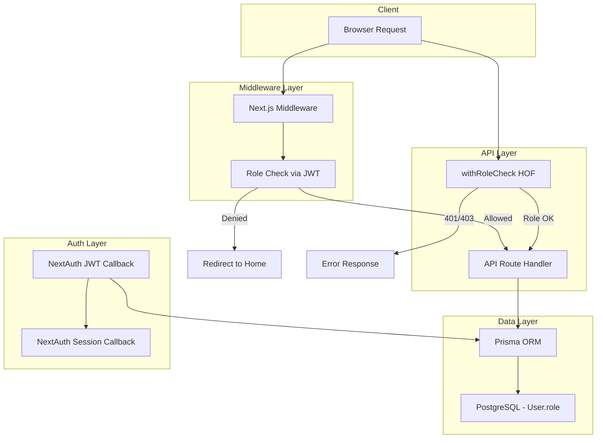

# Design Document: User Roles (RBAC)

## Overview

This design introduces a Role-Based Access Control (RBAC) system to the Kitabisa clone platform. The system adds a hierarchical role model with four levels — ADMIN, MODERATOR, CAMPAIGN_CREATOR, and DONOR — enforced across the middleware layer, API routes, and UI route groups.

The design integrates with the existing NextAuth.js JWT strategy by embedding the role in the session token, enhancing the existing `withAuth` middleware to perform role-based checks, and providing reusable utility functions for role verification throughout the codebase.

### Key Design Decisions

1. **Prisma enum over string field** — Using a PostgreSQL enum ensures database-level validation and prevents invalid role values.
2. **Role hierarchy as ordered numeric levels** — Simplifies `isAtLeast` checks to a single numeric comparison rather than maintaining a permission matrix.
3. **Higher-order function for API protection** — A `withRoleCheck` wrapper keeps route handlers clean and centralizes authorization logic.
4. **Session token carries role** — Avoids a DB query on every request; role is refreshed from DB on each JWT callback (already the pattern for `isVerified`).

## Architecture



### Request Flow

1. **Page routes**: Browser → Middleware (checks JWT role against route config) → Allow or Redirect
2. **API routes**: Client → `withRoleCheck` wrapper → Verify token + role → Allow or 401/403
3. **Session refresh**: NextAuth JWT callback → Fetch `role` from DB → Embed in token → Session callback exposes to client

## Components and Interfaces

### 1. Prisma Schema Changes

```prisma
enum Role {
  ADMIN
  MODERATOR
  CAMPAIGN_CREATOR
  DONOR
}

model User {
  // ... existing fields
  role  Role  @default(DONOR)
}
```

### 2. Role Utility Module (`src/lib/roles.ts`)

```typescript
import { Role } from "@prisma/client";

// Ordered hierarchy (higher number = more privilege)
const ROLE_LEVELS: Record<Role, number> = {
  DONOR: 0,
  CAMPAIGN_CREATOR: 1,
  MODERATOR: 2,
  ADMIN: 3,
};

/** Check if user has a specific role */
export function hasRole(userRole: Role, requiredRole: Role): boolean {
  return userRole === requiredRole;
}

/** Check if user's role is at least the required level (hierarchy) */
export function isAtLeast(userRole: Role, minimumRole: Role): boolean {
  return ROLE_LEVELS[userRole] >= ROLE_LEVELS[minimumRole];
}

/** Throw if user doesn't meet the minimum role. Returns void. */
export function requireRole(userRole: Role, minimumRole: Role): void {
  if (!isAtLeast(userRole, minimumRole)) {
    throw new Error(`Requires at least ${minimumRole} role`);
  }
}
```

### 3. NextAuth Session/JWT Enhancement

**Type augmentation** (`src/types/next-auth.d.ts`):

```typescript
import { Role } from "@prisma/client";

declare module "next-auth" {
  interface Session {
    user: {
      id: string;
      role: Role;
      isVerified: boolean;
      verificationType: string | null;
    } & DefaultSession["user"];
  }
}

declare module "next-auth/jwt" {
  interface JWT extends DefaultJWT {
    id?: string;
    role?: Role;
    isVerified?: boolean;
    verificationType?: string | null;
  }
}
```

**JWT callback change** (in `src/lib/auth.ts`):

```typescript
async jwt({ token, user }) {
  if (user) {
    token.id = user.id;
  }
  if (token.id) {
    const dbUser = await prisma.user.findUnique({
      where: { id: token.id as string },
      select: { isVerified: true, verificationType: true, role: true },
    });
    if (dbUser) {
      token.isVerified = dbUser.isVerified;
      token.verificationType = dbUser.verificationType;
      token.role = dbUser.role;
    }
  }
  return token;
},
async session({ session, token }) {
  if (session.user) {
    session.user.id = token.id as string;
    session.user.role = (token.role as Role) ?? "DONOR";
    session.user.isVerified = token.isVerified as boolean;
    session.user.verificationType = token.verificationType as string | null;
  }
  return session;
},
```

### 4. Middleware Enhancement (`src/middleware.ts`)

```typescript
import { withAuth } from "next-auth/middleware";
import { NextResponse } from "next/server";
import { Role } from "@prisma/client";

// Route-to-minimum-role mapping
const ROLE_ROUTES: { pattern: string; minimumRole: Role }[] = [
  { pattern: "/admin", minimumRole: "ADMIN" },
  { pattern: "/moderasi", minimumRole: "MODERATOR" },
  { pattern: "/campaign/create", minimumRole: "CAMPAIGN_CREATOR" },
];

const ROLE_LEVELS: Record<Role, number> = {
  DONOR: 0,
  CAMPAIGN_CREATOR: 1,
  MODERATOR: 2,
  ADMIN: 3,
};

export default withAuth(
  function middleware(req) {
    const token = req.nextauth.token;
    const pathname = req.nextUrl.pathname;
    const userRole = (token?.role as Role) ?? "DONOR";

    for (const route of ROLE_ROUTES) {
      if (pathname.startsWith(route.pattern)) {
        if (ROLE_LEVELS[userRole] < ROLE_LEVELS[route.minimumRole]) {
          return NextResponse.redirect(new URL("/", req.url));
        }
      }
    }

    // Special case: DONOR trying to create campaign → redirect to verification
    if (pathname.startsWith("/campaign/create") && userRole === "DONOR") {
      return NextResponse.redirect(new URL("/akun/verifikasi", req.url));
    }

    return NextResponse.next();
  },
  {
    callbacks: {
      authorized: ({ token }) => !!token,
    },
    pages: { signIn: "/login" },
  }
);

export const config = {
  matcher: [
    "/donasi-saya/:path*",
    "/inbox/:path*",
    "/akun/:path*",
    "/campaign/create/:path*",
    "/admin/:path*",
    "/moderasi/:path*",
  ],
};
```

### 5. API Route Protection (`src/lib/withRoleCheck.ts`)

```typescript
import { NextRequest, NextResponse } from "next/server";
import { getServerSession } from "@/lib/auth";
import { Role } from "@prisma/client";
import { isAtLeast } from "@/lib/roles";

type RouteHandler = (
  req: NextRequest,
  context?: any
) => Promise<NextResponse>;

export function withRoleCheck(minimumRole: Role, handler: RouteHandler): RouteHandler {
  return async (req, context) => {
    try {
      const session = await getServerSession();

      if (!session?.user) {
        return NextResponse.json({ error: "Unauthorized" }, { status: 401 });
      }

      const userRole = session.user.role ?? "DONOR";

      if (!isAtLeast(userRole as Role, minimumRole)) {
        return NextResponse.json({ error: "Forbidden" }, { status: 403 });
      }

      return handler(req, context);
    } catch (error) {
      return NextResponse.json(
        { error: "Internal server error" },
        { status: 500 }
      );
    }
  };
}
```

### 6. Admin Dashboard Routes

```
src/app/admin/
├── layout.tsx            # Admin layout with sidebar navigation
├── page.tsx              # Dashboard overview (stats)
├── users/
│   ├── page.tsx          # User list with role badges
│   └── [id]/
│       └── page.tsx      # User detail + role management
├── campaigns/
│   ├── page.tsx          # All campaigns list
│   └── [id]/
│       └── page.tsx      # Campaign detail (edit/delete)
└── settings/
    └── page.tsx          # Platform settings
```

### 7. Moderation Panel Routes

```
src/app/moderasi/
├── layout.tsx            # Moderation layout
├── page.tsx              # Overview with pending items
├── campaigns/
│   ├── page.tsx          # Campaigns pending review
│   └── [id]/
│       └── page.tsx      # Campaign review (approve/reject/suspend)
└── reports/
    ├── page.tsx          # User-submitted reports
    └── [id]/
        └── page.tsx      # Report detail
```

### 8. Role Management API

**Endpoint**: `PATCH /api/admin/users/[id]/role`

```typescript
// src/app/api/admin/users/[id]/role/route.ts
import { withRoleCheck } from "@/lib/withRoleCheck";
import { prisma } from "@/lib/prisma";
import { NextRequest, NextResponse } from "next/server";
import { Role } from "@prisma/client";
import { getServerSession } from "@/lib/auth";

const VALID_ROLES: Role[] = ["ADMIN", "MODERATOR", "CAMPAIGN_CREATOR", "DONOR"];

export const PATCH = withRoleCheck("ADMIN", async (req: NextRequest, context) => {
  const { id } = context.params;
  const { role } = await req.json();
  const session = await getServerSession();

  // Validate role value
  if (!VALID_ROLES.includes(role)) {
    return NextResponse.json({ error: "Invalid role" }, { status: 400 });
  }

  // Prevent self-demotion from ADMIN
  if (session!.user.id === id && role !== "ADMIN") {
    return NextResponse.json(
      { error: "Cannot remove ADMIN role from yourself" },
      { status: 400 }
    );
  }

  const updatedUser = await prisma.user.update({
    where: { id },
    data: { role: role as Role },
  });

  // Create notification for affected user
  await prisma.notification.create({
    data: {
      type: "role_changed",
      title: "Role Updated",
      message: `Your role has been changed to ${role}`,
      userId: id,
      link: "/akun",
    },
  });

  return NextResponse.json({ user: updatedUser });
});
```

## Data Models

### Role Enum

| Value | Level | Description |
|-------|-------|-------------|
| ADMIN | 3 | Full platform management access |
| MODERATOR | 2 | Campaign review and report management |
| CAMPAIGN_CREATOR | 1 | Can create and manage own campaigns |
| DONOR | 0 | Default role — browse and donate |

### User Model Changes

| Field | Type | Default | Description |
|-------|------|---------|-------------|
| role | Role (enum) | DONOR | User's current access level |

### Migration Strategy

The migration must handle existing users:

```sql
-- CreateEnum
CREATE TYPE "Role" AS ENUM ('ADMIN', 'MODERATOR', 'CAMPAIGN_CREATOR', 'DONOR');

-- Add column with default
ALTER TABLE "User" ADD COLUMN "role" "Role" NOT NULL DEFAULT 'DONOR';

-- Migrate existing verified users to CAMPAIGN_CREATOR
UPDATE "User" SET "role" = 'CAMPAIGN_CREATOR' WHERE "isVerified" = true;
```

This ensures:
- All new users get `DONOR` by default
- Existing verified users are upgraded to `CAMPAIGN_CREATOR`
- Unverified users remain as `DONOR`
- Admin/moderator roles are assigned manually post-migration

## Correctness Properties

*A property is a characteristic or behavior that should hold true across all valid executions of a system — essentially, a formal statement about what the system should do. Properties serve as the bridge between human-readable specifications and machine-verifiable correctness guarantees.*

### Property 1: Role Hierarchy Correctness

*For any* two roles A and B drawn from {ADMIN, MODERATOR, CAMPAIGN_CREATOR, DONOR}, `isAtLeast(A, B)` returns true if and only if the numeric level of A is greater than or equal to the numeric level of B, where the level ordering is ADMIN(3) > MODERATOR(2) > CAMPAIGN_CREATOR(1) > DONOR(0).

**Validates: Requirements 7.1, 7.2, 7.3, 7.4**

### Property 2: Default Role Assignment

*For any* valid user registration input (any name, email, password combination), the created user record SHALL have role equal to DONOR.

**Validates: Requirements 1.2**

### Property 3: Admin Route Access Control

*For any* route starting with "/admin" and *for any* user with a role, access is granted if and only if the user's role is ADMIN. All other roles (MODERATOR, CAMPAIGN_CREATOR, DONOR) result in a redirect.

**Validates: Requirements 3.1, 3.2**

### Property 4: Moderation Route Access Control

*For any* route starting with "/moderasi" and *for any* user with a role, access is granted if and only if the user's role is at least MODERATOR (i.e., MODERATOR or ADMIN). CAMPAIGN_CREATOR and DONOR result in a redirect.

**Validates: Requirements 4.1, 4.2, 6.5**

### Property 5: API Role Enforcement

*For any* protected API endpoint with a required minimum role, and *for any* authenticated user whose role is below that minimum, the system SHALL return HTTP 403 Forbidden. For any authenticated user whose role meets or exceeds the minimum, the request is allowed through.

**Validates: Requirements 8.1, 8.2**

### Property 6: Role Assignment Restricted to Admin

*For any* user with a role other than ADMIN, any attempt to call the role assignment API SHALL be denied with HTTP 403, regardless of the target user or target role.

**Validates: Requirements 4.5, 9.3**

### Property 7: Role Assignment Validation

*For any* string value that is NOT one of {ADMIN, MODERATOR, CAMPAIGN_CREATOR, DONOR}, a role assignment attempt SHALL be rejected with an error. For any valid role string, the assignment SHALL persist the new role to the database.

**Validates: Requirements 9.1, 9.2**

### Property 8: Self-Demotion Prevention

*For any* administrator attempting to change their own role to any value other than ADMIN, the operation SHALL be rejected.

**Validates: Requirements 9.5**

### Property 9: Graceful Degradation on Missing Role

*For any* session token where the role field is null, undefined, or missing, all role checks SHALL treat the user as having DONOR-level access.

**Validates: Requirements 2.4**

### Property 10: Migration Correctness

*For any* existing user record, after migration: if `isVerified` is true, the role SHALL be CAMPAIGN_CREATOR; if `isVerified` is false, the role SHALL be DONOR.

**Validates: Requirements 10.1, 10.2**

### Property 11: Role Invariant

*For any* User record at any point in time, the role field SHALL contain exactly one value from the set {ADMIN, MODERATOR, CAMPAIGN_CREATOR, DONOR}.

**Validates: Requirements 1.1, 1.3**

### Property 12: Campaign Creator Ownership Enforcement

*For any* campaign not owned by a CAMPAIGN_CREATOR user, that user SHALL be denied edit/delete access. For any campaign owned by that user, access SHALL be granted. ADMIN users bypass this ownership check.

**Validates: Requirements 5.5, 10.4**

## Error Handling

| Scenario | Behavior |
|----------|----------|
| Missing role in JWT token | Default to DONOR-level access |
| Invalid role value in API request body | Return 400 Bad Request with "Invalid role" message |
| Unauthenticated request to protected route | Redirect to `/login` (middleware) |
| Unauthenticated request to protected API | Return 401 Unauthorized |
| Insufficient role for route | Redirect to `/` (middleware) |
| Insufficient role for API | Return 403 Forbidden |
| DB error during role check | Return 500 Internal Server Error (never leak 403 on system errors) |
| Admin self-demotion attempt | Return 400 Bad Request with explanation |
| Role assignment for non-existent user | Return 404 Not Found |
| DONOR attempting campaign creation | Redirect to `/akun/verifikasi` (special case) |

## Testing Strategy

### Unit Tests (Vitest)

Unit tests cover specific examples and edge cases:

- Role utility functions (`hasRole`, `isAtLeast`, `requireRole`) with concrete role pairs
- `withRoleCheck` HOF with mocked sessions for each role level
- Role assignment API validation (invalid role strings, self-demotion)
- Middleware route matching logic with specific paths

### Property-Based Tests (Vitest + fast-check)

Property-based tests verify universal properties across randomized inputs. The project already has `fast-check` installed.

**Configuration**: Minimum 100 iterations per property test.

Each property test references its design document property:

```typescript
// Feature: user-roles, Property 1: Role hierarchy correctness
test.prop([fc.constantFrom(...ROLES), fc.constantFrom(...ROLES)], ([roleA, roleB]) => {
  // isAtLeast(roleA, roleB) === (ROLE_LEVELS[roleA] >= ROLE_LEVELS[roleB])
});
```

**Properties to implement as PBT**:
- Property 1: Role hierarchy (generate all role pairs, verify isAtLeast correctness)
- Property 2: Default role assignment (generate random registration data, verify DONOR)
- Property 3: Admin route access (generate role + admin paths, verify access/deny)
- Property 4: Moderation route access (generate role + mod paths, verify access/deny)
- Property 5: API role enforcement (generate role + required role pairs, verify 403/allow)
- Property 6: Role assignment restricted to admin (generate non-ADMIN roles, verify denial)
- Property 7: Role assignment validation (generate valid/invalid role strings, verify accept/reject)
- Property 8: Self-demotion prevention (generate non-ADMIN roles for self-assignment, verify denial)
- Property 9: Graceful degradation (generate null/undefined/missing role tokens, verify DONOR behavior)
- Property 10: Migration correctness (generate user records with various isVerified states)
- Property 11: Role invariant (generate user mutations, verify role remains valid)
- Property 12: Ownership enforcement (generate user/campaign ownership combinations)

### Integration Tests

- End-to-end role assignment flow (admin changes user role, user's next request reflects change)
- Session refresh after role change
- Notification creation on role change
- Migration script execution on test database

### Test Tag Format

All property tests include a comment tag:

```
// Feature: user-roles, Property {N}: {property title}
```

