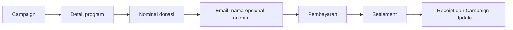
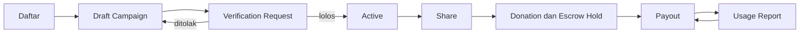
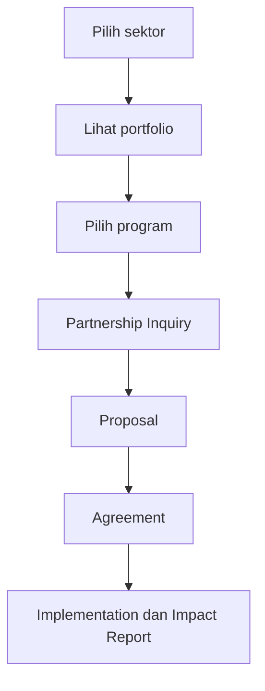

# PRD Fund for Indonesia

Product Requirements Document, revisi 22 September 2026 atas versi 19 September 2026. Platform dioperasikan PT Jaya Korpora Prima; Yayasan Indonesia Emas Merdeka (YIEM) adalah organisasi program pertama di atasnya.
Sumber: deck "Website Menu & User Flow, Makam.co.id × Fund for Indonesia", sepuluh slide, audit kode repositori fundforindonesia.org per 19 September 2026, dan keputusan pemilik produk 22 September 2026 (lihat pasal 14).

Istilah di dokumen ini mengikuti glosarium di [CONTEXT.md](../CONTEXT.md). Keputusan yang sulit dibalik tercatat di [docs/adr](./adr/).

## 1. Ringkasan

Fund for Indonesia adalah platform social impact yang menyatukan donasi, galang dana, zakat, wakaf, hibah, dan kolaborasi CSR dalam satu ekosistem. Volunteer tetap menjadi bagian produk tetapi tidak lagi memegang slot menu utama; lihat pasal 3 dan pasal 14.

Proposisi nilai: satu pintu bagi individu, komunitas, perusahaan, influencer, dan filantropi untuk berkontribusi, dengan program terverifikasi dan pelaporan dampak yang bisa ditelusuri.

Pesan utama homepage: "Connecting Generosity with Real Impact in Indonesia." CTA utama Donate Now, CTA sekunder Start a Fundraiser, CSR Collaboration, Waqf, dan Hibah. Elemen kepercayaan: program terverifikasi, pelaporan transparan, dan dampak terukur.

## 2. Konteks dan latar belakang

Kontribusi sosial berupa donasi, zakat, wakaf, hibah, dan CSR saat ini tersebar di banyak kanal, dan penyumbang sulit melihat bukti penyaluran serta dampaknya. Perusahaan yang mencari mitra CSR juga butuh portofolio program siap implementasi, bukan proposal yang disusun dari nol setiap kali. Volunteer tetap dilayani di luar slot menu utama; pesertanya membayar Trip Fee untuk menutup biaya partisipasinya sendiri, bukan berdonasi (lihat pasal 14).

Prinsip UX yang berlaku, sesuai deck: menu utama singkat, CTA jelas, proses transparan, status kontribusi mudah dilacak, dan trust serta accountability ditampilkan sejak awal.

Kondisi saat ini, hasil audit kode: sudah ada platform galang dana berjalan di repositori fundforindonesia.org dengan katalog Campaign, donasi, moderasi, buku besar berpasangan, escrow, dan payout. Donasi dinonaktifkan sampai ada penyedia pembayaran nyata. Belum ada zakat sebagai Kind, wakaf, hibah, CSR, volunteer, pengiriman email, dan dwibahasa. Platform didaftarkan atas nama PT Jaya Korpora Prima agar seragam dengan platform lain dalam grup; YIEM berperan sebagai Partner Organisation yang menjalankan program, bukan pemilik platform.

## 3. Struktur menu utama

Deck memberi dua versi menu, bahasa Indonesia pada slide 6 untuk pengunjung lokal, dan bahasa Inggris pada slide 7 sebagai terminologi untuk donatur internasional, mitra, dan pengunjung korporat. Revisi 22 September 2026 mengganti slot menu kelima Volunteer dengan Hibah; lihat pasal 14 untuk alasannya.

| Bahasa Indonesia | Deskripsi versi Indonesia | English | Deskripsi versi Inggris |
| --- | --- | --- | --- |
| Donasi | Pilih campaign dan berdonasi langsung; zakat ada di dalam menu ini | Donate | Explore verified campaigns and make a contribution; zakat lives here |
| Galang Dana | Buat campaign bersama individu, influencer, atau komunitas | Start a Fundraiser | Create a fundraising campaign for a social cause |
| Kolaborasi CSR | Program siap kolaborasi, portfolio, dan diskusi dengan tim | CSR Collaboration | Explore programs, impact portfolios, and discuss partnership |
| Wakaf | Wakaf masjid, sekolah, fasilitas kesehatan, fasilitas umum | Waqf | Support waqf for mosques, schools, healthcare, and public facilities |
| Hibah | Hibah untuk lembaga atau tujuan tertentu, Kind Campaign tersendiri | Hibah | Directed grants for institutions or specific purposes |

Menu pendukung versi Indonesia: Tentang Kami, Impact & Transparency, Stories, Mitra, Volunteer, FAQ, Hubungi Kami, dan Masuk atau Dashboard. Versi Inggris: About Us, Impact & Transparency, Stories, Partners, Volunteer, FAQ, Contact, dan Sign In atau Dashboard. Volunteer pindah ke menu pendukung sejak revisi 19 September 2026; cakupannya (FFI-11, FFI-12) diperluas pada revisi 22 September 2026 menjadi jalur berbayar, lihat pasal 14.

Keputusan penulisan: "Wakaf" pada versi Indonesia, "Waqf" pada versi Inggris untuk menu dan CTA. Slug URL tetap /wakaf pada kedua bahasa. Zakat tidak menjadi menu tersendiri agar menu utama tetap ringkas; zakat adalah halaman di bawah Donasi. "Hibah" dipertahankan sebagai transliterasi pada kedua versi bahasa, mengikuti pola Wakaf/Waqf, karena istilah ini tidak punya padanan Inggris yang presisi. Slug URL /hibah pada kedua bahasa.

## 4. Target pengguna

| Persona | Situasi | Yang dibutuhkan dari platform |
| --- | --- | --- |
| Donor, termasuk Guest Donor | Ingin berdonasi cepat, sering dari tautan yang dibagikan, tanpa wajib akun | Alur donasi pendek, pilihan nominal, Receipt ke email, Campaign Update |
| Fundraiser | Perorangan atau organisasi yang membuka Campaign | Draft Campaign, Verification Request cepat, materi berbagi, Payout, Usage Report |
| Perusahaan atau tim CSR | Mencari program siap implementasi dan bukti dampak | Portofolio Program per Sector, anggaran dan KPI, Partnership Inquiry |
| Wakif | Berwakaf tunai untuk masjid, sekolah, fasilitas kesehatan, atau fasilitas umum | Kategori wakaf, pilihan Campaign wakaf, Akad Wakaf, pembaruan implementasi |
| Donor Hibah | Memberi hibah untuk lembaga atau tujuan tertentu | Campaign Kind `hibah`, kejelasan tujuan dan penerima, pembaruan implementasi |
| Volunteer | Ingin ikut Volunteer Trip sesuai jadwal dan anggaran | Katalog Volunteer Trip dan Batch, Trip Fee, Registration terkonfirmasi setelah pembayaran, sertifikat |
| Verifier | Menjaga kredibilitas platform | Antrean Verification Request, checklist dokumen, verifikasi identitas dan Bank Account, jejak audit |
| Admin | Menjaga uang | Persetujuan Payout, Suspension, Refund, Manual Contribution, rekonsiliasi harian, rekap keuangan |

Verifier dan Admin adalah penugasan terpisah; satu orang boleh memegang keduanya (ADR 0005).

## 5. Tujuan dan metrik keberhasilan

1. Menyatukan tujuh jalur kontribusi (donasi, galang dana, zakat, wakaf, hibah, CSR, volunteer) dalam satu akun dan satu riwayat dampak.
2. Membuat donasi selesai dalam hitungan menit dari tautan yang dibagikan, tanpa wajib mendaftar.
3. Menjadikan transparansi sebagai fitur, bukan halaman terpisah: setiap kontribusi punya jejak penyaluran.

| Metrik | Definisi | Target awal |
| --- | --- | --- |
| Conversion halaman campaign | Donation dengan Settlement dibagi kunjungan halaman Campaign | Di atas 5 persen |
| Waktu donasi | Median dari halaman Campaign sampai Settlement | Di bawah 3 menit |
| Donatur berulang | Donor dengan dua Donation atau lebih dalam 6 bulan, dicocokkan lewat email | Di atas 20 persen |
| Waktu verifikasi campaign | Median dari Submitted sampai Active per Verification Request | Di bawah 2 hari kerja |
| Ketepatan pelaporan | Payout Completed yang punya Usage Report lengkap dalam 30 hari sejak Completed | Di atas 95 persen |

Target di atas usulan awal dan perlu dikunci sebelum pengembangan. Rata-rata donasi dan jumlah Partnership Inquiry per kuartal sengaja tidak masuk tabel ini karena belum punya target; keduanya dipantau sebagai laporan operasional biasa, dan metrik tanpa target bukan metrik.

## 6. Ruang lingkup rilis pertama

Rilis pertama mencakup Fase 0 sampai 2 pada pasal 11. Fase 3 menyusul. Satu entitas Campaign membawa seluruh uang daring; lihat [ADR 0002](./adr/0002-one-campaign-entity-for-all-money.md).

### Masuk

- Katalog Campaign dengan Category, pencarian, lokasi, dan halaman detail.
- Donasi tanpa wajib membuat akun, dengan Receipt ke email, halaman cetak Receipt, dan opsi anonim.
- Zakat sebagai Kind Campaign dengan kalkulator zakat, hanya oleh organisasi yang memegang Kind Authorisation `zakat`.
- Wakaf tunai sebagai Kind Campaign oleh organisasi yang memegang Kind Authorisation `wakaf`, per kategori masjid, sekolah, fasilitas kesehatan, fasilitas umum, dengan Akad Wakaf per Donation. Wakaf aset lewat Asset Waqf Inquiry.
- Hibah sebagai Kind Campaign, hanya oleh organisasi yang memegang Kind Authorisation `hibah`; lihat FFI-08b dan pasal 14 untuk status keputusan ini.
- Portofolio CSR dengan katalog Program per Sector dan Partnership Inquiry; lihat FFI-09 dan FFI-10. Dipindah dari Fase 3 ke rilis pertama pada revisi ini (pasal 14); Program tidak menerima uang daring, mengikuti [ADR 0002](./adr/0002-one-campaign-entity-for-all-money.md).
- Pembuatan Campaign oleh pengguna terdaftar: Draft, unggah dokumen, Verification Request, publikasi.
- Verifikasi identitas Fundraiser sebelum publish dan verifikasi Bank Account sebelum Payout pertama.
- Payout dengan aturan dua orang, Escrow Hold, Usage Report wajib sebelum Payout berikutnya, dan laporan tampil publik.
- Suspension oleh Admin atas laporan Verifier, dengan Refund yang dimulai Admin.
- Manual Contribution untuk dana yang masuk di luar gateway.
- Dashboard kontributor: riwayat Donation dan Campaign, kirim ulang dan cetak Receipt.
- Halaman Impact & Transparency dengan angka agregat dan daftar Usage Report per Campaign.
- Traffic Source pada Donation.
- Panel Verifier dan panel Admin: verifikasi, Payout, rekonsiliasi harian, rekap keuangan.
- Notifikasi email untuk Receipt, Campaign Update, hasil verifikasi, dan Payout.

### Dikecualikan dari rilis pertama, masuk Fase 3 atau setelahnya

- Versi bahasa Inggris. Pendekatan i18n dipilih di Fase 1 agar halaman baru ditulis dengan kunci terjemahan sejak awal.
- Volunteer Trip, Batch, Registration berbayar, sertifikat volunteer. Portofolio CSR dan Partnership Inquiry dipindah ke rilis pertama; lihat bagian Masuk di atas.
- Notifikasi WhatsApp.
- Tautan pendek untuk berbagi.
- Impor otomatis laporan settlement penyedia untuk rekonsiliasi.
- Refund yang diminta sendiri oleh Donor.
- Anggota tim untuk Fundraiser organisasi.

### Dikecualikan tanpa jadwal

- Aplikasi mobile native.
- Donasi berulang otomatis dengan penarikan kartu terjadwal. Fitur AutoDonation yang ada di kode diparkir.
- Dompet saldo pengguna. Fitur TopUp yang ada di kode dihapus.
- Integrasi langsung ke sistem akuntansi perusahaan mitra.
- Marketplace merchandise atau lelang amal.
- Penerbitan sertifikat wakaf digital berbasis blockchain.
- Pencocokan relawan otomatis berbasis keahlian.

## 7. Kebutuhan fungsional

| ID | Modul | User story | Kriteria terima | Pri | Fase |
| --- | --- | --- | --- | --- | --- |
| FFI-01 | Donasi | Sebagai Donor saya berdonasi tanpa harus mendaftar | Pilihan nominal cepat dan nominal bebas minimum Rp20.000; Platform Fee dibebaskan untuk Donation di bawah Rp50.000 sehingga donasi kecil hanya terkena Provider Fee; email wajib, nama dan telepon opsional; opsi anonim yang menyembunyikan identitas dari publik dan dari Fundraiser; Platform Fee, Provider Fee, dan lama Escrow Hold yang berlaku disalin ke Payment saat dibuat dan ditampilkan sebelum Donor membayar, sehingga janji yang dilihat Donor tidak berubah setelah ia membayar; hanya pembayaran QRIS lewat Sumopod sebelum launching, VA dan e-wallet menyusul lewat penyedia tambahan setelah launching; Payment kedaluwarsa dalam 24 jam, Donation ditutup otomatis saat penyedia mengabarkan kedaluwarsa, dan Donor bisa mencoba bayar lagi lewat Payment baru pada Donation yang sama; Receipt terkirim ke email setelah Settlement; Traffic Source tercatat | M | 1 |
| FFI-02 | Detail campaign | Sebagai Donor saya menilai kredibilitas program sebelum menyumbang | Halaman memuat masalah, penerima manfaat dengan jumlah opsional, lokasi provinsi dan kabupaten/kota, target, Gross terkumpul, tenggat, Campaign Update terakhir, Platform Fee dan lama Escrow Hold, rincian Platform Fee dan Provider Fee sehingga Donor tahu berapa yang sampai ke Campaign, daftar Payout Completed beserta Usage Report, yang kosong sampai Fase 2 | M | 1 |
| FFI-03 | Campaign Update | Sebagai Donor saya menerima kabar penggunaan dana | Fundraiser menulis Campaign Update dari dashboard; terkirim ke email semua Donor termasuk Guest Donor; Campaign tidak bisa ditandai Completed tanpa minimal satu Campaign Update; pengingat email saat tenggat tinggal tujuh hari | M | 1 |
| FFI-04 | Buat campaign | Sebagai Fundraiser saya membuat Campaign dan mengunggah dokumen | Setiap pengguna terdaftar bisa membuat Draft; formulir memuat Kind, Category, target, dan tenggat wajib kecuali `wakaf`, dengan lokasi dan penerima manfaat menyusul di Fase 1; unggah dokumen per Kind sesuai pasal 7.1; simpan Draft; submit membuat Verification Request; durasi maksimal 12 bulan, kecuali Campaign `wakaf` tanpa tenggat yang tidak pernah Expired dan hanya berhenti saat ditandai Completed; maksimal tiga Campaign Active sebelum Usage Report pertama diterima, berlaku sejak Fase 2 | M | 0 |
| FFI-05 | Verifikasi | Sebagai Verifier saya meloloskan atau menolak Campaign dengan alasan | Antrean Verification Request; checklist dokumen per Kind; petunjuk berisi paling banyak lima Campaign lain yang memenuhi salah satu dari tiga hal: Fundraiser sama, kemiripan trigram judul di atas 0,6 memakai ekstensi Postgres `pg_trgm`, atau nama penerima manfaat sama persis; ambang 0,6 diatur Admin; butir checklist "bukan duplikat"; verifikasi identitas Fundraiser pada Verification Request pertamanya; catatan penolakan terkirim ke Fundraiser lewat email; Campaign Rejected bisa direvisi dan disubmit ulang tanpa batas, setiap submit adalah Verification Request baru; jejak audit memuat pelaku, waktu, dan hasil; perubahan target, tenggat, atau Bank Account pada Campaign Active membuat Verification Request baru sementara Campaign tetap menerima Donation dengan nilai lama; bila Verification Request itu ditolak, Campaign tetap Active dengan nilai lama dan perubahannya dibuang; Fundraiser boleh menarik Verification Request selama Verifier belum memutuskan, dan Campaign kembali ke Draft bila itu pengajuan pertamanya | M | 0 |
| FFI-06 | Berbagi campaign | Sebagai Fundraiser saya membagikan Campaign ke media sosial | Gambar pratinjau dari sampul; tombol bagikan WhatsApp, Facebook, X, salin tautan; Traffic Source per tautan dihitung dari parameter sumber; tautan pendek ditunda ke Fase 3 | S | 1 |
| FFI-07 | Pencairan dana | Sebagai Fundraiser saya mengajukan Payout atas Campaign Balance | Payout hanya dari Campaign Balance yang dihitung dari buku besar setelah Escrow Hold yang berlaku, dihitung sejak perkiraan settlement penyedia dan bukan sejak Donor membayar; sebelum menyetujui, Admin wajib memeriksa saldo nyata di dashboard penyedia dan mencatat angkanya pada Payout, karena tanpa API saldo sistem tidak bisa memastikannya sendiri; Bank Account terverifikasi lewat pengecekan nama di penyedia bila tersedia, atau Verifier secara manual; Payout parsial boleh saat Campaign Active; persetujuan Admin yang bukan pemintanya, dan Admin yang menandai Completed harus berbeda dari Admin yang menyetujui, sehingga selalu ada dua orang berbeda di sisi operator pada setiap rupiah yang keluar; status Payout terlihat Fundraiser; pencairan dilakukan Admin kedua secara manual dari dashboard penyedia langsung ke rekening Fundraiser, lalu Payout ditandai Completed di panel dengan bukti transfer; bila kelak ada penyedia dengan API disbursement, instruksi ke penyedia baru dikirim setelah Admin kedua mengonfirmasinya, sehingga tetap ada dua orang operator pada setiap rupiah yang keluar, dan webhook hanya memindahkan Processing ke Completed karena itu fakta dari penyedia, dengan bukti transfer digantikan referensi penyedia; Usage Report wajib pada setiap Payout Completed sebelum Payout berikutnya; akumulasi Gross di atas Rp100 juta per Campaign membutuhkan pemeriksaan ulang Verifier | M | 2 |
| FFI-07a | Usage Report | Sebagai Fundraiser saya melaporkan pemakaian dana sebuah Payout | Narasi, rincian per pos yang jumlahnya sama dengan nominal Payout, minimal satu foto bukti, jumlah penerima manfaat; tampil publik di halaman Campaign sejak dikirim, tanpa menunggu tinjauan; Admin bisa menandai "dipertanyakan", dan penanda itu beserta alasannya juga tampil publik, sekaligus memblokir Payout berikutnya | M | 2 |
| FFI-07b | Suspension | Sebagai Admin saya membekukan Campaign bermasalah | Verifier menandai "dilaporkan", Admin memutuskan Suspension; Suspension menghentikan Donation, membekukan Escrow Hold dan Campaign Balance, menolak Payout, dan menyembunyikan Campaign dari katalog; alasan tercatat dan tampil ke Fundraiser; Suspension bisa dicabut Admin lain | M | 2 |
| FFI-07c | Manual Contribution | Sebagai Admin saya mencatat dana yang masuk di luar gateway | Hanya Admin; bukti transfer wajib; aturan dua orang seperti Payout; langsung menjadi Campaign Balance, atau Program Balance bila menunjuk ke Program, tanpa Escrow Hold dan tanpa kedua fee; tercatat di buku besar pada akun terpisah; masuk angka terkumpul dengan penanda tersendiri; bisa dibalikkan lewat jurnal lawan selama belum ada Payout yang memakai dana itu, tidak pernah dihapus | M | 2 |
| FFI-07d | Refund | Sebagai Donor saya menerima kembali uang saya ketika Donation saya dibatalkan | Lihat pasal 7.2 untuk rancangan lengkap: pemicu, siklus status, sumber dana, batas per Kind, dan pencatatan | M | 2 |
| FFI-08 | Wakaf | Sebagai Wakif saya berwakaf pada kategori dan Campaign tertentu | Kind `wakaf` hanya oleh organisasi yang memegang Kind Authorisation `wakaf` dari Verifier; kategori masjid, sekolah, fasilitas kesehatan, fasilitas umum; target wajib, tenggat opsional; Platform Fee default nol; ikrar lewat centang persetujuan saat checkout; Akad Wakaf otomatis per Donation dikirim bersama Receipt; wakaf aset lewat Asset Waqf Inquiry dengan status tindak lanjut; pembaruan implementasi lewat Campaign Update | M | 1 |
| FFI-08a | Zakat | Sebagai muzaki saya menunaikan zakat lewat Campaign zakat | Kind `zakat` hanya oleh organisasi yang memegang Kind Authorisation `zakat` dari Verifier; nama organisasi tampil sebagai Fundraiser; kalkulator zakat; Platform Fee default nol; halaman zakat di bawah menu Donasi | M | 1 |
| FFI-08b | Hibah | Sebagai Donor Hibah saya memberi hibah untuk lembaga atau tujuan tertentu | Kind `hibah` hanya oleh organisasi yang memegang Kind Authorisation `hibah` dari Verifier; target wajib, tenggat mengikuti aturan umum Campaign; Platform Fee default nol; sementara mengikuti batas Refund dan dokumen wajib `wakaf` sampai ditinjau ulang terhadap ketentuan syariah (lihat pasal 14 dan [ADR 0013](./adr/0013-hibah-as-fourth-kind.md)); pembaruan implementasi lewat Campaign Update | M | 1 |
| FFI-09 | Portofolio CSR | Sebagai tim CSR saya menelusuri Program per Sector | Kartu Sector Health, Education, Environment, Disability Inclusion; halaman Program memuat Problem, Target beneficiaries, Location, Activities, Budget, Timeline, KPI, Documentation, Impact Report, lalu CTA Discuss with Our Team; Program tidak menerima uang daring; dana CSR yang melewati rekening platform dicatat sebagai Manual Contribution yang menunjuk ke Program dan dikreditkan ke Program Balance, akun buku besar tersendiri yang tidak pernah bisa dicairkan lewat Payout karena Program bukan Campaign, dengan aturan dua orang yang sama; dana CSR yang tidak pernah melewati rekening platform hanya ditampilkan sebagai angka laporan dan ditandai jelas sebagai di luar pembukuan platform | M | 1 |
| FFI-10 | Diskusi kemitraan | Sebagai tim CSR saya menghubungi tim untuk membahas Program | Formulir Discuss with Our Team membuat Partnership Inquiry dengan data perusahaan dan kebutuhan; notifikasi email ke tim kemitraan; status tindak lanjut | M | 1 |
| FFI-11 | Volunteer | Sebagai Volunteer saya mendaftar satu Volunteer Batch dan membayar Trip Fee-nya | Katalog Volunteer Trip dengan destinasi, itinerary, dan Trip Fee; pilihan Batch dengan tanggal, kuota maksimum, dan kuota minimum; Registration terkonfirmasi hanya setelah Trip Fee Settlement, kuota tidak berkurang sebelum itu; bila kuota minimum Batch tidak tercapai sampai tenggat pendaftaran, Fundraiser membatalkan Batch dan setiap Registration yang sudah bayar menerima Refund penuh; pembatalan oleh Volunteer sendiri mengikuti Refund bertingkat menurut jarak waktu ke keberangkatan, bukan Refund Gross Campaign (ADR 0007); tidak ada Platform Fee atas Trip Fee | M | 3 |
| FFI-12 | Rekam jejak relawan | Sebagai Volunteer saya menerima sertifikat dan catatan kontribusi | Sertifikat digital dan rekam Registration pada dashboard | S | 3 |
| FFI-13 | Dashboard kontributor | Sebagai pengguna saya melihat seluruh kontribusi saya | Riwayat Donation termasuk zakat dan wakaf serta Campaign milik saya dalam satu halaman, dengan Registration menyusul di Fase 3; kirim ulang Receipt ke email dan buka halaman cetak Receipt; Guest Donor yang mendaftar dengan email yang sama melihat riwayatnya hanya setelah email akun itu diverifikasi lewat tautan konfirmasi, sehingga tidak ada yang bisa mengklaim riwayat orang lain; Fundraiser melihat Escrow Hold, Campaign Balance, dan daftar Donation tanpa identitas Donor anonim; bagian Payout menyusul di Fase 2 | M | 1 |
| FFI-14 | Impact & Transparency | Sebagai pengunjung saya melihat penyaluran dana secara agregat | Terkumpul = Gross semua Payment dengan Settlement ditambah Manual Contribution, tidak termasuk Campaign yang sedang disembunyikan sebagai Demo Campaign dan tidak termasuk Manual Contribution yang sudah dibalikkan; Donation yang direfund tetap dihitung di terkumpul dan muncul sebagai baris pengembalian, karena uangnya memang pernah masuk; terkumpul diurai menjadi enam baris yang jumlahnya persis sama dengannya: tersalurkan lewat Payout Completed, dikembalikan ke Donor dari dana Campaign sebesar Gross dikurangi Provider Fee-nya, ditahan di Escrow Hold termasuk yang dibekukan menunggu Refund, tersedia di Campaign Balance, Platform Fee yang tidak dikembalikan, dan Provider Fee seluruh Payment; Refund yang tidak tertutup dana Campaign karena uangnya sudah keluar lewat Payout tidak mengurangi baris tersalurkan dan hanya muncul pada angka biaya platform, bersama Provider Fee yang tidak kembali, keduanya ditampilkan terpisah karena itu uang platform dan bukan bagian dari terkumpul; penerima manfaat = jumlah dari Usage Report; tersalurkan dan penerima manfaat nol sampai Fase 2; Manual Contribution masuk tanpa kedua fee dan ditandai tersendiri; daftar Usage Report per Campaign; dana CSR sebagai baris terpisah menyusul begitu Portofolio CSR aktif di Fase 1, dipisah antara yang masuk pembukuan dan yang di luar pembukuan; filter lokasi | M | 1 |
| FFI-15 | Dwibahasa | Sebagai pengunjung internasional saya membaca situs dalam bahasa Inggris | Pengalih bahasa; seluruh menu utama dan halaman Campaign serta Program tersedia dalam dua bahasa; slug URL tetap Indonesia; nominal tetap IDR dengan perkiraan mata uang lain sebagai tampilan saja | M | 3 |
| FFI-16 | Privasi Donor | Sebagai Donor saya bisa meminta identitas saya dihapus | Anonimisasi nama, email, dan telepon pada Donation atas permintaan; nominal dan jurnal tetap; data keuangan disimpan sepuluh tahun; Guest Donor meminta lewat tautan di Receipt, pengguna terdaftar lewat pengaturan akun | M | 2 |
| FFI-17 | Pengaturan Platform Fee dan Escrow Hold | Sebagai Admin saya mengubah Platform Fee, ambang bebas fee, lama Escrow Hold, dan metode pembayaran dari dashboard | Nilai default per Kind, override per Category, dan override per Campaign, semuanya dari panel Admin; perubahan hanya berlaku untuk Donation setelah perubahan karena setiap Payment menyimpan Platform Fee, Provider Fee, dan lama Escrow Hold yang berlaku saat ia dibuat; nilai yang berlaku tampil di halaman Campaign; Campaign bencana boleh memakai metode settlement cepat dan Escrow Hold yang dipendekkan; setiap perubahan tercatat dengan pelaku dan waktu | M | 1 |
| FFI-18 | Penyedia pembayaran ganda | Sebagai Admin saya mengaktifkan penyedia pembayaran dari dashboard | Antarmuka penyedia yang sama untuk Sumopod, Midtrans, Xendit, DOKU, Stripe, dan lainnya; Admin mengaktifkan penyedia dan metode per penyedia; setiap Payment menyimpan penyedia dan referensinya; webhook per penyedia dengan verifikasi tanda tangan masing-masing; rekonsiliasi per penyedia; Refund dan Payout memakai penyedia yang mendukung disbursement | M | 2 |

### 7.1 Dokumen wajib per Kind saat submit

| Kind | Dokumen |
| --- | --- |
| Semua | KTP Fundraiser perorangan atau akta pendirian organisasi; rencana anggaran; bukti masalah berupa foto, surat keterangan, atau tautan berita |
| `wakaf` | Dokumen lembaga nazhir sesuai ketentuan Platform Operator, draf akad wakaf, dan Kind Authorisation `wakaf` |
| `zakat` | Dokumen lembaga amil sesuai ketentuan Platform Operator dan Kind Authorisation `zakat` |
| `hibah` | Dokumen lembaga penerima sesuai ketentuan Platform Operator dan Kind Authorisation `hibah`; mengikuti pola `wakaf` sampai ditinjau ulang (pasal 14) |

Daftar dokumen per Kind adalah konfigurasi checklist yang diubah Admin dari panel, bukan kode.

### 7.2 Rancangan Refund

Dasar keputusan: [ADR 0007](./adr/0007-refunds-return-gross-platform-absorbs-provider-fee.md).

Refund selalu mengembalikan **Gross**, yaitu persis yang Donor bayar. Provider Fee tidak dikembalikan penyedia, sehingga selisihnya ditanggung platform dan dicatat sebagai biaya refund di buku besar. Donor yang uangnya dikembalikan karena Campaign bermasalah tidak boleh menerima lebih kecil dari yang ia berikan.

#### Pemicu

| Pemicu | Cakupan | Siapa memulai |
| --- | --- | --- |
| Suspension karena penyalahgunaan | Seluruh Payment Campaign yang dananya belum keluar | Admin, satu keputusan untuk seluruh Campaign |
| Cancelled, Fundraiser menarik diri sebelum ada Payout Completed | Seluruh Payment Campaign | Fundraiser mengajukan, Admin menyetujui |
| Donor salah bayar, ganda, atau salah Campaign | Satu Payment, penuh atau sebagian | Donor menghubungi, Admin membuat |
| Dana masuk setelah Campaign Completed atau Expired | Payment yang bersangkutan | Otomatis diusulkan sistem, Admin memutuskan |
| Dana masuk setelah Campaign Suspended atau Cancelled | Payment yang bersangkutan | Otomatis masuk antrean Refund dengan alasan yang sama seperti Campaign-nya |

Donor tidak bisa memulai Refund sendiri lewat antarmuka. Permintaan masuk lewat kontak dan Admin yang membuatnya, karena refund menyentuh uang yang sudah dibukukan.

Webhook Settlement selalu diterima dan dicatat, apa pun status Campaign saat itu. Menolaknya berarti uang Donor ada di penyedia tanpa jejak di sistem, yang jauh lebih buruk daripada satu Refund tambahan.

#### Siklus status

`Requested` → `AwaitingDonorDetails` → `Approved` → `Processing` → `Completed`, dengan `Rejected` dari dua status pertama dan `Failed` dari `Processing`. Refund `Failed`, misalnya karena rekening ditolak bank, kembali ke `AwaitingDonorDetails` agar Donor bisa memperbaiki rekeningnya.

- **Requested**: Refund dibuat, nominal ditetapkan, dan dana yang bersangkutan dipindahkan lewat jurnal dari Escrow Hold atau Campaign Balance ke Frozen Balance, seketika. Pembekuan adalah jurnal, bukan penanda, karena Campaign Balance selalu dihitung dari buku besar; tanpa jurnal itu dana yang dibekukan masih terlihat tersedia bagi Fundraiser dan masih bisa ikut Payout.
- **AwaitingDonorDetails**: Donor menerima email berisi tautan bertanda tangan berumur 30 hari untuk mengisi rekening tujuan. Tautan hanya membuka formulir rekening, tidak menampilkan data lain. Verifier memeriksa rekening itu secara manual dan nama pemiliknya harus cocok dengan nama pada Donation. Donation anonim atau tanpa nama membutuhkan pemeriksaan tambahan berupa komunikasi balik ke email yang membayar. Donation yang datanya sudah dianonimkan lewat FFI-16 tidak bisa direfund lewat sistem dan ditangani di luar.
- **Approved**: rekening lengkap, Verifier sudah memeriksa rekening tujuan, dan Admin menyetujui. Aturan dua orang berlaku sama seperti Payout: Admin yang menyetujui harus berbeda dari Admin yang membuat Refund, dan Admin yang menandai Completed harus berbeda dari Admin yang menyetujui.
- **Processing**: Admin menarik dana dari dashboard penyedia ke rekening Donor.
- **Completed**: Admin menandai selesai dengan bukti transfer. Tanpa bukti, tidak bisa selesai.

Bila tautan kedaluwarsa tanpa diisi, Refund kembali ke `Requested` dan dana tetap beku. Dana itu tetap menjadi hak Donor tanpa batas waktu dan tidak pernah kembali ke Campaign Balance maupun ikut aturan Dormant Balance, karena itu uang yang sudah diputuskan bukan milik Campaign. Admin mengirim ulang tautan atas permintaan Donor kapan saja.

#### Sumber dana dan batas

Urutan pengambilan: Escrow Hold Payment itu dulu, lalu Campaign Balance, lalu dana platform. Refund tidak pernah membuat Campaign Balance negatif; bagian yang tidak tertutup keduanya didebit dari akun biaya refund, sehingga platform yang menanggungnya dan jumlahnya tetap terlihat.

Yang sudah keluar lewat Payout Completed tidak bisa ditarik kembali oleh sistem. Untuk bagian itu Refund hanya bisa dilakukan bila platform memilih menanggungnya, dan keputusan itu dicatat tersendiri sebagai kerugian. Penagihan ke Fundraiser berjalan di luar sistem.

Refund sebagian diperbolehkan. Akumulasi seluruh Refund atas satu Payment tidak boleh melebihi Gross Payment itu. Pada Refund sebagian, Platform Fee dan Provider Fee yang dikembalikan dihitung proporsional terhadap porsi Gross yang direfund dan dibulatkan ke atas tetapi jumlah keduanya tidak pernah melebihi nominal yang direfund, sehingga sisa pecahan ditanggung platform, bukan Donor. Kaki Frozen Balance menjadi sisanya, yaitu nominal yang direfund dikurangi kedua fee itu, tidak pernah negatif, agar ketiga debit selalu berjumlah persis nominal yang dikembalikan.

#### Batas per Kind

Kind `zakat`, `wakaf`, dan `hibah` tidak mengembalikan dana atas keputusan pengelola, karena zakat yang sudah ditunaikan dan wakaf yang sudah diikrarkan tidak kembali kepada pemberinya; `hibah` mengikuti batas yang sama sebagai asumsi sementara (pasal 14, [ADR 0013](./adr/0013-hibah-as-fourth-kind.md)), bukan keputusan final yang sudah diperiksa terhadap ketentuan syariah untuk hibah. Untuk ketiga Kind itu Refund hanya sah pada kegagalan teknis: salah bayar, bayar ganda, atau dana masuk setelah Campaign ditutup.

Bila Campaign `zakat`, `wakaf`, atau `hibah` disuspensi, dananya tidak dikembalikan melainkan dialihkan ke Campaign lain dengan Kind yang sama, dan untuk `wakaf` juga kategori yang sama. Sistem menolak pengalihan lintas Kind, bukan sekadar memperingatkan. Setiap Donor yang terdampak diberi tahu ke mana dananya pergi.

#### Pencatatan

Saat Refund yang dananya tertutup Frozen Balance disetujui, buku besar memposting empat kaki: mendebit Frozen Balance sebesar Net, mendebit pendapatan Platform Fee sebesar Platform Fee yang dulu diambil, mendebit akun biaya refund sebesar Provider Fee, dan mengkredit kliring refund sebesar Gross. Ketiga debit itu berjumlah persis Gross, karena Net adalah Gross dikurangi kedua fee. Saat selesai, kliring refund didebit dan saldo penyedia dikredit sebesar Gross.

Artinya Platform Fee ikut dikembalikan, sedangkan Provider Fee tidak bisa ditarik kembali dari penyedia sehingga menjadi biaya platform yang selalu bisa dijumlahkan.

Bila dana Campaign tidak menutupinya, misalnya karena uangnya sudah keluar lewat Payout, kaki Frozen Balance dibatasi pada nominal yang benar-benar dibekukan dan seluruh kekurangannya, termasuk bagian Platform Fee-nya, didebit dari akun biaya refund. Pendapatan Platform Fee tidak dibalik pada kasus ini. Refund semacam itu berada di luar keenam baris halaman Impact dan hanya muncul pada angka biaya platform.

Donation yang direfund tetap dihitung pada angka terkumpul, karena uangnya memang pernah masuk, dan muncul sebagai baris pengembalian pada halaman Impact & Transparency. Yang berkurang adalah angka dana yang tersedia dan yang ditahan, bukan angka terkumpul maupun angka tersalurkan.

#### Pemberitahuan

Donor menerima email pada tiga titik: saat Refund dibuat beserta alasannya, saat rekening diminta, dan saat dana dikirim beserta bukti. Fundraiser diberi tahu setiap Refund atas Campaign-nya beserta dampaknya pada Campaign Balance.

### 7.3 Dormant Balance

Campaign yang Expired atau Completed dan masih memegang Campaign Balance muncul di laporan Admin setelah 60 hari. Saldo itu baru disebut Dormant Balance setelah 180 hari dan tiga pengingat. Laporan 60 hari masuk rilis pertama karena murah dan karena tanpanya tidak ada yang tahu dana mengendap.

Penanganannya tidak. Pengalihan Dormant Balance ke Campaign lain masuk roadmap, bukan rilis pertama: setelah 180 hari tanpa Payout dan tanpa tanggapan atas tiga pengingat, Admin mengalihkan saldo ke Campaign lain milik Partner Organisation yang sama dengan Kind yang sama, dan untuk `wakaf` juga kategori yang sama, dengan aturan dua orang, pemberitahuan ke seluruh Donor Campaign asal, dan catatan permanen di halaman Campaign asal. Sampai fitur itu ada, Dormant Balance ditangani Admin kasus per kasus lewat Payout biasa ke penerima yang disepakati.

Fundraiser organisasi memakai satu akun per organisasi dengan nama organisasi tampil sebagai Fundraiser.

## 8. Alur pengguna utama

Donasi, alur terpendek dan paling sering dipakai:

Galang dana:

Siklus hidup Campaign: Draft → Submitted → Rejected atau Active → Completed atau Expired, dengan Cancelled dari Active dan Suspended dari Active, Expired, maupun Completed (ADR 0015). Suspension dijatuhkan Admin dengan alasan tercatat dan hanya dicabut Admin lain; saat dicabut Campaign kembali ke status sebelum Suspension, kecuali Campaign yang tadinya Active dan tenggatnya sudah lewat, yang menjadi Expired. Cancelled adalah penarikan diri Fundraiser secara jujur, diajukan sendiri dan disetujui Admin, hanya selama belum ada Payout Completed; Suspended adalah pembekuan karena masalah. Keduanya dibedakan di halaman Campaign agar Fundraiser yang mundur baik-baik tidak terlihat seperti yang dibekukan. Hanya Active menerima Donation. Expired terjadi otomatis saat tenggat lewat dan Campaign tetap memegang dananya (keep-it-all, ADR 0004). Target tercapai tidak menutup Campaign; Completed ditetapkan Fundraiser atau Admin dan membutuhkan minimal satu Campaign Update. Usage Report menjadi syarat Payout berikutnya.

Kolaborasi CSR, siklus terpanjang dan melibatkan tim kemitraan:

Wakaf: pilih kategori, pilih Campaign wakaf, tentukan nominal, ikrar lewat centang, bayar, Akad Wakaf terkirim bersama Receipt, lalu Campaign Update sebagai pembaruan implementasi. Wakaf aset: Asset Waqf Inquiry, tindak lanjut nazhir terkait, akad manual.

Hibah: pilih Campaign Kind `hibah`, tentukan nominal, bayar, Receipt terkirim, lalu Campaign Update sebagai pembaruan implementasi. Tidak ada Akad Wakaf maupun ikrar; dokumen dan alur akad khusus untuk hibah menyusul bila ditinjau ulang membutuhkannya (pasal 14).

Volunteer, di luar menu utama: telusuri Volunteer Trip, buka detail destinasi dan itinerary, pilih Batch, Registration, bayar Trip Fee, konfirmasi setelah Settlement, ikut Batch, lalu sertifikat atau rekam dampak.

### Portofolio sektor CSR

| Sektor | English | Cakupan menurut deck |
| --- | --- | --- |
| Kesehatan | Health | Program kesehatan masyarakat, pemeriksaan, akses layanan |
| Pendidikan | Education | Literasi, keterampilan, sekolah, talenta masa depan |
| Lingkungan | Environment | Air, penghijauan, konservasi, circular economy |
| Disabilitas | Disability Inclusion | Akses, pemberdayaan, pendidikan dan fasilitas inklusif |

Sector tetap empat dan diubah lewat kode. Category Campaign dikelola Admin dari panel.

## 9. Kebutuhan non fungsional, kepatuhan, dan teknis

| Aspek | Ketentuan |
| --- | --- |
| Platform | Web responsif, mobile first; banyak Donor datang dari tautan di media sosial |
| Performa | Largest Contentful Paint halaman Campaign di bawah 2,5 detik pada persentil 75, diukur pada jaringan 4G |
| Skalabilitas | Menahan 500 donasi bersamaan tanpa kegagalan dan tanpa entri buku besar yang tidak seimbang; antrean pembayaran tidak boleh memblokir halaman |
| Kepatuhan | Izin penghimpunan, amil, dan nazhir adalah urusan Platform Operator dan Partner Organisation di luar dokumen ini. Yang disediakan sistem: Kind Authorisation yang diberikan Verifier; tanggal berlaku Kind Authorisation yang diisi Verifier bersama pemberian izinnya, dengan pengingat 30 hari sebelum habis; Campaign ber-Kind `zakat`, `wakaf`, atau `hibah` otomatis berhenti menerima Donation begitu tanggal itu lewat, tetap terlihat, dananya tetap bisa dicairkan, dan langsung terbuka kembali saat izin diperpanjang; penanda audit pada Campaign dengan akumulasi Gross di atas Rp500 juta; laporan Campaign yang masih memegang Campaign Balance lebih dari 60 hari setelah Expired atau Completed; ekspor laporan penghimpunan dan penyaluran per Campaign |
| Keuangan | Lapisan penyedia pembayaran yang netral: Sumopod sebagai penyedia pertama sebelum launching, penyedia lain diaktifkan Admin setelah launching (ADR 0006). Setiap akun merchant milik Fund for Indonesia sendiri. Provider Fee dibaca dari webhook penyedia, tidak diasumsikan nol. Dana mengendap di saldo penyedia sampai Admin menariknya; buku besar mencatat saldo itu sebagai akun tersendiri sehingga selisih antara saldo penyedia dan rekening bank selalu terlihat. Buku besar memisahkan setiap entri per Kind dan per penyedia; rekening penghimpunan per Kind dikonfigurasi Admin dan pemiliknya boleh berbeda dari Platform Operator, karena akun merchant dan rekening penghimpunan adalah dua hal berbeda. Rekonsiliasi harian sepenuhnya manual selama Sumopod satu-satunya penyedia, karena tidak ada API saldo: Admin membaca dashboard penyedia, mencocokkannya dengan laporan rekonsiliasi internal, dan mencatat hasilnya |
| Mata uang | IDR saja; Donor luar negeri membayar dengan kartu lewat penyedia yang sama |
| Pembulatan | Seluruh nominal adalah bilangan bulat rupiah, termasuk setiap baris buku besar. Platform Fee dibulatkan ke bawah sehingga sisa pecahan selalu jatuh ke Campaign, bukan ke platform. Provider Fee diambil apa adanya dari payload penyedia dan tidak pernah dihitung ulang |
| Anti penyalahgunaan | Identitas Fundraiser diverifikasi sebelum publish; akumulasi Gross di atas Rp100 juta per Campaign memicu verifikasi tambahan Verifier; akumulasi di atas Rp500 juta memberi penanda audit pada Campaign; Donation tunggal di atas Rp50 juta ditandai untuk Admin lihat tanpa diblokir; petunjuk Campaign mirip pada Verification Request; batas tiga Campaign Active sebelum Usage Report pertama |
| Keamanan data | Kolom email, telepon, nama, dan nomor rekening dienkripsi di tingkat kolom; sisanya mengandalkan enkripsi disk; akses panel berbasis penugasan Verifier dan Admin; Donation anonim tidak menampilkan identitas ke publik maupun Fundraiser; hak anonimisasi sesuai FFI-16 |
| Konkurensi | Setiap operasi yang menyentuh saldo sebuah Campaign, yaitu Payout, Refund, Manual Contribution, dan pelepasan Escrow Hold, mengunci baris Campaign dan menghitung ulang saldo di dalam kunci itu. Setiap transisi status memakai pembaruan berpredikat sehingga dua Admin yang menekan tombol bersamaan hanya menghasilkan satu perubahan |
| Audit | Setiap Verification Request, Payout, Suspension, Refund, Manual Contribution, dan perubahan Usage Report tercatat dengan pelaku dan waktu; buku besar hanya tambah, tidak ubah |
| Stack | Next.js, Prisma, dan Postgres, mengikuti repositori yang sudah berjalan (ADR 0001) |
| Integrasi | Sumopod QRIS saja sebelum launching, lewat halaman pembayaran ter-hosting dengan webhook bertanda tangan svix HMAC, tanpa API saldo maupun riwayat penarikan, rincian di [catatan integrasi Sumopod](./integrasi-sumopod.md); Midtrans, Xendit, DOKU, Stripe, dan lainnya lewat antarmuka penyedia yang sama setelah launching, membawa VA, e-wallet, kartu, dan disbursement; email transaksional sejak Fase 0; WhatsApp Business API di Fase 3; penyimpanan dokumen |
| Bahasa | Indonesia sejak rilis pertama; Inggris di Fase 3 dengan kunci terjemahan disiapkan sejak Fase 1 |
| Notifikasi | Email transaksional berdiri sejak Fase 0 karena hasil verifikasi harus sampai ke Fundraiser; Receipt dan Campaign Update menyusul di Fase 1 |

## 10. Model bisnis

| Sumber | Mekanisme | Catatan |
| --- | --- | --- |
| Donasi dan galang dana | Platform Fee sebagai persentase Gross, diatur Admin dari dashboard per Kind dengan override per Category dan per Campaign, ditampilkan terbuka di halaman Campaign | Nilai awal saat rilis diisi Admin; usulan 5 persen untuk `donation` dan nol untuk Category bencana |
| Zakat | Platform Fee default nol, bisa diubah Admin | Pengaturan bagian amil adalah keputusan lembaga amil |
| Wakaf | Platform Fee default nol, bisa diubah Admin | Mengikuti ketentuan nazhir |
| Hibah | Platform Fee default nol, bisa diubah Admin | Asumsi sementara mengikuti pola Wakaf; ditinjau ulang (pasal 14) |
| Kolaborasi CSR | Biaya pengelolaan program per kerja sama, masuk dalam anggaran Program | Sumber pendapatan paling besar per transaksi |
| Volunteer | Trip Fee menutup biaya partisipasi Volunteer sendiri; bukan pendapatan platform, tidak dipotong Platform Fee, mengikuti preseden seluruh jalur lain yang juga belum mengambil Platform Fee | Trip Fee terpisah dari Donation dan bukan Kind Campaign; lihat [ADR 0014](./adr/0014-volunteer-trip-stays-separate-entity.md) |

Provider Fee dipotong dari Gross sebelum dana dikreditkan ke Campaign dan bukan pendapatan platform. Net = Gross dikurangi Provider Fee dan Platform Fee.

## 11. Rencana rilis bertahap

Urutan disusun ulang mengikuti kondisi kode.

| Fase | Cakupan | Syarat lolos fase |
| --- | --- | --- |
| Fase 0, fondasi | Siklus hidup Campaign, Verification Request dengan checklist dan alasan penolakan, email transaksional untuk hasil verifikasi, Kind dan Kind Authorisation (termasuk `hibah`), penugasan Verifier dan Admin terpisah, penghapusan dompet, pemarkiran AutoDonation | Satu Campaign lolos Verification Request dan tampil tanpa intervensi basis data |
| Fase 1, MVP | Adapter Sumopod QRIS dengan webhook dan Provider Fee nyata dari payload, tanpa metode lain; Platform Fee di buku besar dengan pengaturan Admin (FFI-17); Receipt dan Campaign Update lewat email yang sudah berdiri sejak Fase 0; Guest Donor; Traffic Source; lokasi dan penerima manfaat; zakat, wakaf tunai dengan Akad Wakaf, dan hibah (FFI-08b); dashboard kontributor; halaman Impact & Transparency; Demo Campaign disembunyikan dari katalog dan Impact saat Campaign nyata pertama Active; Portofolio CSR dan Partnership Inquiry (FFI-09, FFI-10), dipindah dari Fase 3 pada revisi ini — berjalan pada rentang waktu yang sama tetapi tidak menjadi syarat lolos fase karena jalur uangnya terpisah (Manual Contribution ke Program Balance, bukan gateway) | Donasi QRIS nyata pertama berhasil end to end dan Receipt diterima |
| Fase 2, pendalaman | UI Payout untuk Fundraiser, Payout Completed manual oleh Admin dengan bukti, Usage Report dan gating-nya, Suspension, Cancelled, Refund oleh Admin dengan batas per Kind, laporan Campaign yang belum mencairkan saldo selama 60 hari, Manual Contribution, anonimisasi Donor, verifikasi tambahan di atas ambang, penanda audit, pengaturan penyedia ganda (FFI-18) dengan penyedia kedua yang membawa VA, e-wallet, dan disbursement | Alur Payout dan Usage Report berjalan tanpa intervensi basis data; Payment dari dua penyedia terekonsiliasi |
| Fase 3, perluasan | Volunteer Trip, Batch, Registration berbayar, sertifikat volunteer, versi bahasa Inggris, WhatsApp, tautan pendek, impor settlement otomatis, pengalihan Dormant Balance, Refund yang diminta sendiri oleh Donor, anggota tim untuk Fundraiser organisasi | Volunteer Trip pertama berjalan end to end sampai sertifikat terbit, termasuk satu Batch yang menerima Trip Fee nyata dan satu Refund Trip Fee |

Tanggal per fase belum ditetapkan karena bergantung pada kapasitas tim dan keputusan Platform Operator.

## 12. Risiko dan asumsi

| Risiko | Dampak | Mitigasi |
| --- | --- | --- |
| Penyalahgunaan Campaign | Sanksi regulator dan kehilangan kepercayaan publik | Identitas sebelum publish, checklist dokumen, Usage Report sebelum Payout berikutnya, Suspension dan Refund, verifikasi tambahan di atas ambang |
| Izin penghimpunan berjangka pendek dan dana wajib tersalurkan dalam batas waktu | Izin kedaluwarsa tanpa disadari, atau Campaign Balance mengendap | Tanggal berlaku Kind Authorisation diisi Verifier dengan pengingat 30 hari sebelum habis; laporan Campaign Expired atau Completed yang masih memegang Campaign Balance lebih dari 60 hari |
| Sumopod hanya QRIS, tanpa API disbursement maupun API saldo | Donor tanpa QRIS tidak punya cara membayar sama sekali; pencairan, refund, dan rekonsiliasi dikerjakan tangan | Terima sebagai batas Fase 1 dan ukur berapa Donor yang terhenti di halaman pembayaran; penyedia kedua yang membawa VA dan e-wallet diaktifkan di Fase 2 lewat antarmuka yang sama; kerja tangan dibatasi bukti wajib dan aturan dua orang |
| Dana mengendap di saldo Sumopod, bukan di rekening penghimpunan | Saldo buku besar tidak sama dengan uang di bank, dan tidak ada yang menyadarinya | Saldo penyedia menjadi akun buku besar tersendiri; laporan rekonsiliasi menampilkan selisihnya setiap hari |
| Beban operasional verifikasi manual | Waktu verifikasi melar | Target dua hari kerja masuk metrik, checklist baku, tambah Verifier saat antrean naik |
| Data lama di produksi: 30 Campaign dan 88 Donation tanpa jurnal | Angka platform tidak jujur, Campaign fiktif menerima uang nyata | Sudah ditandai Demo Campaign dan ditolak menerima uang; disembunyikan dari katalog dan Impact saat Campaign nyata pertama Active |
| Dikerjakan bersamaan dengan Makam.co.id oleh tim yang sama | Keduanya lambat | Fase 0 dan 1 dijalankan berurutan, atau dua tim terpisah dengan komponen bersama yang disepakati di awal |
| Kind `hibah` diberi Kind Authorisation, batas Refund, dan dokumen wajib yang meniru `wakaf` tanpa dasar syariah yang diperiksa (pasal 14) | Aturan salah untuk instrumen yang secara fiqih berbeda dari wakaf; perlu perubahan pada sistem yang sudah berjalan begitu ditinjau | Perlakuan ditandai eksplisit sebagai asumsi sementara di [ADR 0013](./adr/0013-hibah-as-fourth-kind.md), CONTEXT.md, dan dokumen ini; tinjau dengan penasihat syariah sebelum Kind `hibah` menerima donasi nyata |

Asumsi utama: PT Jaya Korpora Prima menyediakan Verifier, Admin, dan akun merchant; Partner Organisation menyediakan legalitas penghimpunan dan program; pengembangan melanjutkan repositori yang sudah berjalan.

## 13. Pertanyaan terbuka

Diputuskan 19 September 2026:

- [x] Platform Fee diatur Admin dari dashboard (FFI-17); nilai awal diisi Admin saat rilis.
- [x] Sumopod QRIS sebagai satu-satunya penyedia sebelum launching; Midtrans, Xendit, DOKU, Stripe, dan lainnya diaktifkan setelah launching lewat antarmuka penyedia yang sama (FFI-18, ADR 0006).
- [x] Verifikasi tambahan pada akumulasi Gross Rp100 juta per Campaign, penanda audit pada Rp500 juta, penanda Donation tunggal di atas Rp50 juta.
- [x] Minimal satu Verifier dan dua Admin di sisi Platform Operator; nama diisi operator.
- [x] Penulisan Wakaf pada versi Indonesia, Waqf pada versi Inggris.
- [x] Versi bahasa Inggris di Fase 3.
- [x] Stack mengikuti repositori berjalan.
- [x] Platform didaftarkan atas nama PT Jaya Korpora Prima; YIEM menjadi Partner Organisation (ADR 0009).

Diputuskan 22 September 2026:

- [x] Hibah menjadi Kind Campaign keempat (`hibah`), menggantikan slot menu utama Volunteer; Volunteer tetap ada di produk lewat menu pendukung, cakupannya tidak berubah pada keputusan ini secara spesifik (lihat butir Trip Fee di bawah untuk perluasan cakupan yang menyusul pada revisi yang sama).
- [x] Portofolio CSR dan Partnership Inquiry (FFI-09, FFI-10) dipindah dari Fase 3 ke Fase 1, berjalan paralel dengan jalur uang tanpa menjadi syarat lolos fase, karena Program tetap tidak menerima uang daring ([ADR 0002](./adr/0002-one-campaign-entity-for-all-money.md)).
- [x] Sebagai langkah sementara sampai ditinjau ulang, Kind `hibah` mengikuti pola `wakaf`: Kind Authorisation wajib, Platform Fee default nol, dan Refund hanya sah pada kegagalan teknis. Lihat [ADR 0013](./adr/0013-hibah-as-fourth-kind.md).
- [x] Volunteer menjadi jalur berbayar: Volunteer membayar Trip Fee untuk menutup biaya partisipasinya sendiri, bukan berdonasi. Trip Fee tetap terpisah dari Campaign, Kind, dan Donation, memakai infrastruktur Payment, Escrow Hold, dan Payout yang sama. Lihat [ADR 0014](./adr/0014-volunteer-trip-stays-separate-entity.md).
- [x] Volunteer Event diperluas menjadi Volunteer Trip (katalog milik satu Fundraiser, dipakai ulang lintas jadwal) dan Volunteer Batch (satu jadwal bertanggal dengan kuota maksimum dan kuota minimum sendiri).
- [x] Registration terkonfirmasi hanya setelah Trip Fee Settlement; kuota Batch tidak berkurang sebelum itu.
- [x] Refund Trip Fee mengikuti kebijakan bertingkat menurut jarak waktu ke keberangkatan saat Volunteer membatalkan, dan penuh tanpa syarat waktu saat Fundraiser membatalkan Batch karena kuota minimum tidak tercapai — berbeda dari Refund Gross Campaign (ADR 0007), yang tidak berlaku untuk Trip Fee.
- [x] Volunteer Trip dibuat oleh Fundraiser mana pun, sama seperti Campaign, bukan hanya Platform Operator.
- [x] Tidak ada Platform Fee atas Trip Fee, mengikuti preseden seluruh jalur lain yang belum mengambil Platform Fee.

Masih terbuka, perlu ditinjau sebelum Kind `hibah` menerima donasi nyata:

- [ ] Apakah batas Refund, kebutuhan Kind Authorisation, dan dokumen wajib untuk `hibah` seharusnya mengikuti pola `wakaf`, atau punya aturan sendiri berdasarkan ketentuan syariah untuk hibah yang berbeda dari wakaf. Lihat ADR 0013.
- [ ] Istilah dan syarat kelembagaan yang setara amil/nazhir untuk penerima Kind `hibah`, bila diperlukan.

Masih terbuka, perlu ditinjau sebelum Volunteer Trip pertama menerima Trip Fee nyata:

- [ ] Ambang hari tepat untuk setiap tingkat Refund Trip Fee menurut jarak waktu ke keberangkatan, dan nilai default kuota minimum Batch. Didorong ke penulisan spec (lihat ADR 0014); pasal ini hanya mengunci kebijakannya (bertingkat, bukan flat Gross), bukan angkanya.
- [ ] Lama jendela penahanan kursi (Registration yang belum bayar) sebelum kembali terbuka untuk Volunteer lain.

Di luar dokumen ini: izin penghimpunan, lembaga amil untuk Kind `zakat`, nazhir untuk Kind `wakaf`, lembaga penerima untuk Kind `hibah`, dan pemilik rekening penghimpunan per Kind. Satu hal yang perlu diperiksa penasihat hukum sebelum rilis: ketentuan izin penghimpunan dana sosial mensyaratkan pemegang izin berbentuk yayasan atau perkumpulan, sedangkan Platform Operator berbentuk PT, sehingga dana kemungkinan harus dihimpun atas nama Partner Organisation meski akun merchant dipegang Platform Operator. Sistem sudah menyiapkan pemisahan itu lewat rekening penghimpunan yang dikonfigurasi terpisah dari akun merchant.

## 14. Catatan validasi terhadap deck

Seluruh isi slide 2, 6, 7, 8, 9, dan 10 yang menyangkut Fund for Indonesia tetap tercakup, dengan satu perubahan pada revisi 22 September 2026: slot menu kelima deck (Volunteer) diganti Hibah atas keputusan pemilik produk, di luar isi deck. Zakat tetap berada di bawah Donasi, tidak berubah dari revisi sebelumnya.

| Slide | Isi | Letak di dokumen ini |
| --- | --- | --- |
| 2 | Definisi platform social impact dan lima jalur kontribusi | Ringkasan |
| 6 | Lima menu utama versi Indonesia dan menu pendukung | Struktur menu utama |
| 7 | Lima menu versi Inggris dan supporting navigation | Struktur menu utama |
| 8 | Alur donasi, galang dana, CSR, wakaf, dan volunteer | Alur pengguna utama |
| 9 | Empat sektor CSR dan format halaman program | Portofolio sektor CSR, FFI-09 |
| 10 | Headline, CTA utama dan sekunder, elemen kepercayaan | Ringkasan |

Yang ditambahkan pada revisi ini di luar versi 18 September dan sudah disetujui pemilik produk pada 19 September 2026:

- Zakat sebagai Kind keenam, di bawah menu Donasi, dengan Kind Authorisation untuk zakat dan wakaf.
- Siklus hidup Campaign lengkap dengan Cancelled dan Suspended, Verification Request, dan keep-it-all.
- Akad Wakaf per Donation dan Asset Waqf Inquiry untuk wakaf non-tunai.
- Usage Report sebagai entitas dengan gating Payout dan sumber angka penerima manfaat.
- Rancangan Refund lengkap pada pasal 7.2, termasuk pengembalian sebesar Gross, batas per Kind, dan pencatatannya.
- Manual Contribution, Traffic Source, privasi Donor, dan laporan Dormant Balance.
- Penugasan Verifier dan Admin terpisah.
- Platform Fee dan Escrow Hold yang diatur Admin dari dashboard, dengan pembebasan fee di bawah ambang.
- Lapisan penyedia pembayaran netral dengan Sumopod sebagai penyedia pertama, dan Provider Balance sebagai akun buku besar.
- Penyusunan ulang fase sesuai kondisi kode, penghapusan dompet, dan pemarkiran AutoDonation.

Yang diubah dari versi 18 September:

- Baris stack: SvelteKit, ElysiaJS, Drizzle diganti Next.js, Prisma, Postgres.
- Dwibahasa dipindah dari rilis pertama ke Fase 3, menyelesaikan ketidakkonsistenan antara pasal 6 dan 11 versi lama.
- "Unduhan tanda terima" pada FFI-13 dipenuhi lewat halaman cetak Receipt dan kirim ulang email, bukan berkas PDF.
- Tautan pendek pada FFI-06 ditunda ke Fase 3.
- Opsi tip donatur pada model bisnis dihapus seluruhnya (ADR 0008); operasional dibiayai Platform Fee saja.
- Minimum donasi Rp20.000 dengan pembebasan Platform Fee di bawah Rp50.000, karena komponen biaya tetap penyedia memukul donasi kecil.
- Pengalihan Dormant Balance dipindah ke roadmap; yang masuk rilis pertama hanya laporannya.

### Revisi 22 September 2026

Perubahan pada revisi ini, disetujui pemilik produk, di luar isi deck asli:

- Hibah ditambahkan sebagai Kind Campaign keempat (FFI-08b), menggantikan slot menu utama kelima yang sebelumnya dipegang Volunteer. Ini satu-satunya perubahan pada struktur lima menu deck sejak revisi 19 September.
- Volunteer tidak dihapus, hanya pindah dari menu utama ke menu pendukung dan tetap di Fase 3. Cakupannya (FFI-11, FFI-12) diperluas menjadi jalur berbayar oleh keputusan berikutnya pada revisi yang sama; lihat butir Trip Fee di bawah.
- Portofolio CSR dan Partnership Inquiry (FFI-09, FFI-10) dipindah dari Fase 3 ke Fase 1, karena kedua modul ini dianggap bagian inti produk. Tidak menjadi syarat lolos Fase 1 karena jalur uangnya (Manual Contribution ke Program Balance) terpisah dari jalur donasi.
- Perlakuan Kind `hibah` — Kind Authorisation, batas Refund, dokumen wajib, Platform Fee default nol — dibuat mengikuti pola `wakaf` sebagai **asumsi sementara**, bukan keputusan final: tidak ada rujukan syariah yang diperiksa untuk hibah secara spesifik pada revisi ini. Dicatat di [ADR 0013](./adr/0013-hibah-as-fourth-kind.md) dan sebagai risiko terbuka di pasal 12.
- Metrik "enam jalur kontribusi" pada pasal 5 menjadi tujuh, mengikutkan hibah.
- Volunteer diperluas dari jalur non-uang menjadi jalur berbayar (Trip Fee), berdasarkan referensi program Traveling & Teaching (1000 GURU Foundation): Volunteer Event menjadi Volunteer Trip (katalog milik satu Fundraiser, dipakai ulang lintas jadwal) dan Volunteer Batch (satu jadwal bertanggal dengan kuota maksimum dan kuota minimum). Keputusan ini di luar isi deck asli, seperti halnya Hibah. Lihat [ADR 0014](./adr/0014-volunteer-trip-stays-separate-entity.md).
- Trip Fee sengaja tidak menjadi Kind Campaign kelima meski sekarang memindahkan uang, karena sifatnya menutup biaya partisipasi Volunteer sendiri, bukan kontribusi untuk tujuan sosial pihak lain — berbeda dari alasan yang membuat Hibah masuk sebagai Kind. FFI-11 diperbarui untuk mencerminkan model berbayar; tetap di Fase 3, prioritas tidak berubah.
